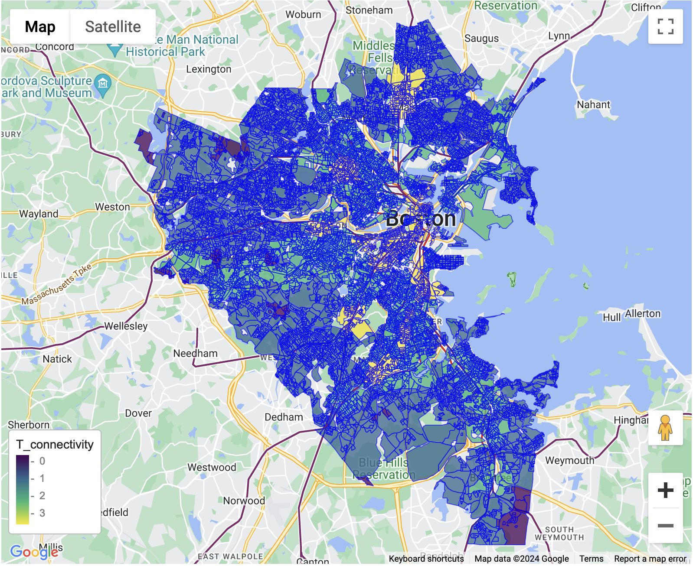
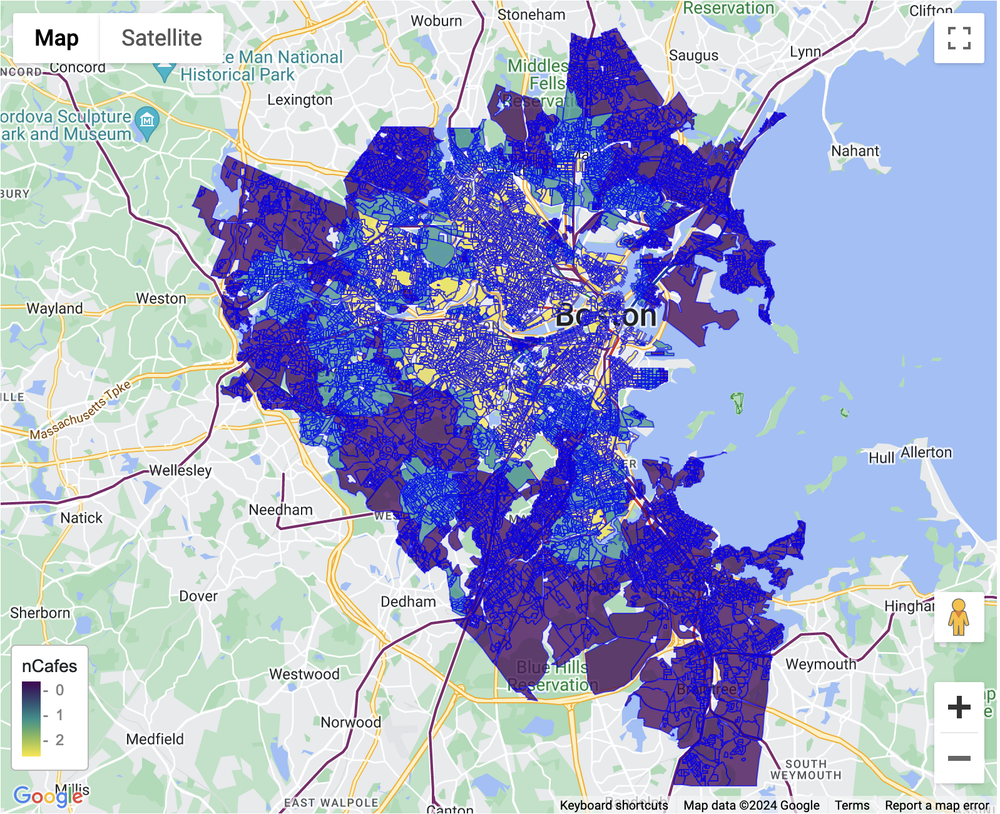
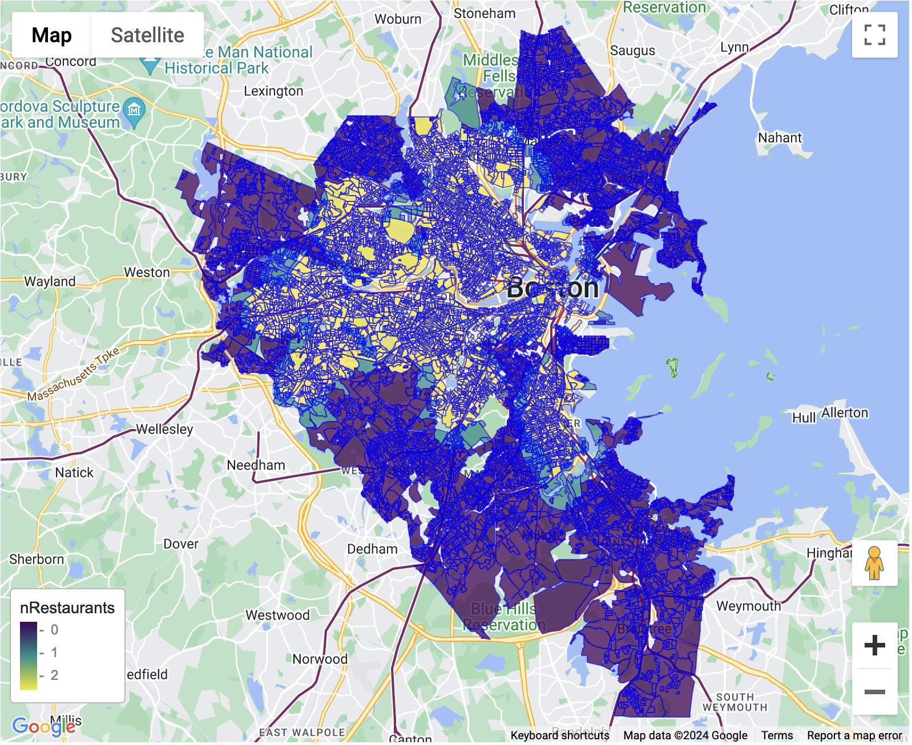
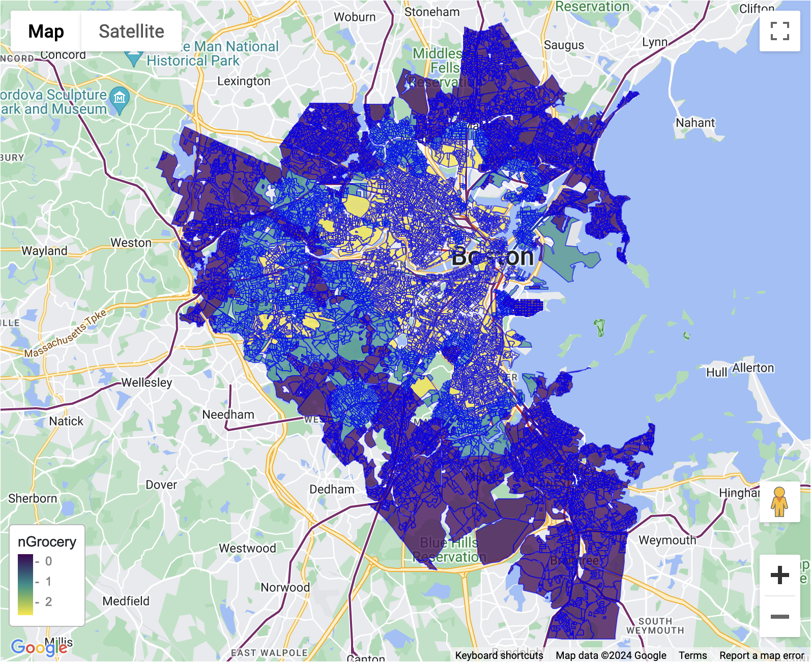
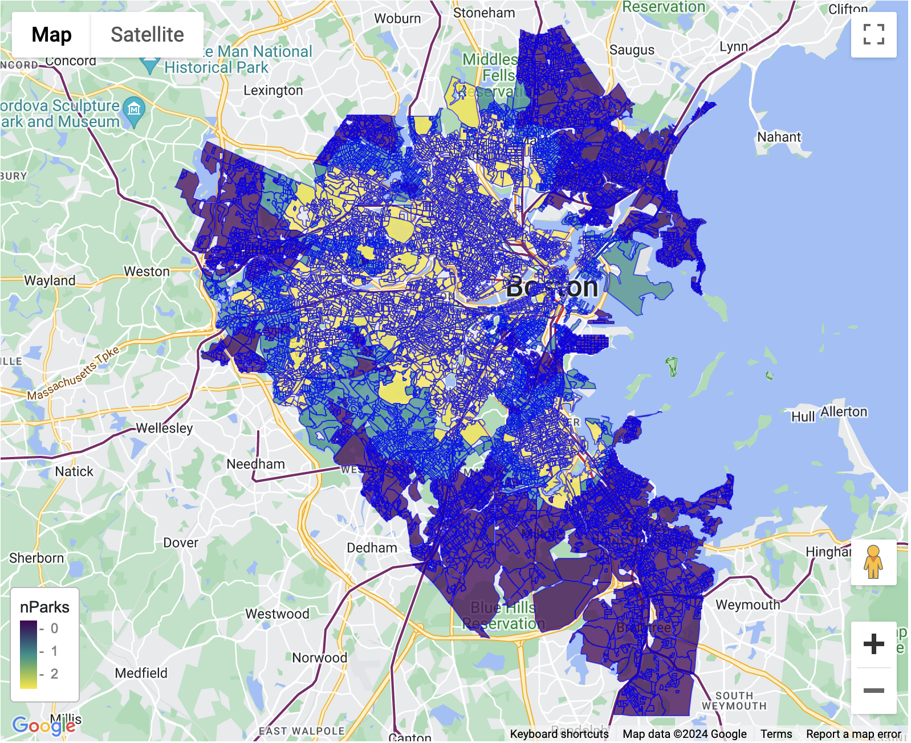
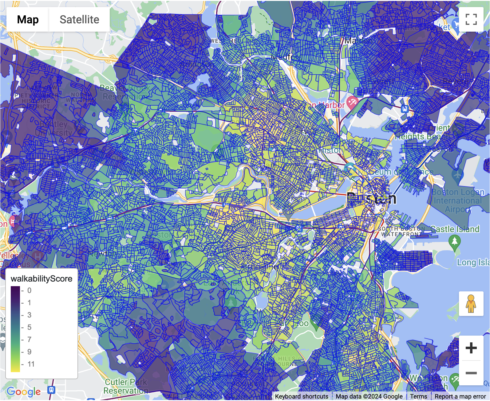
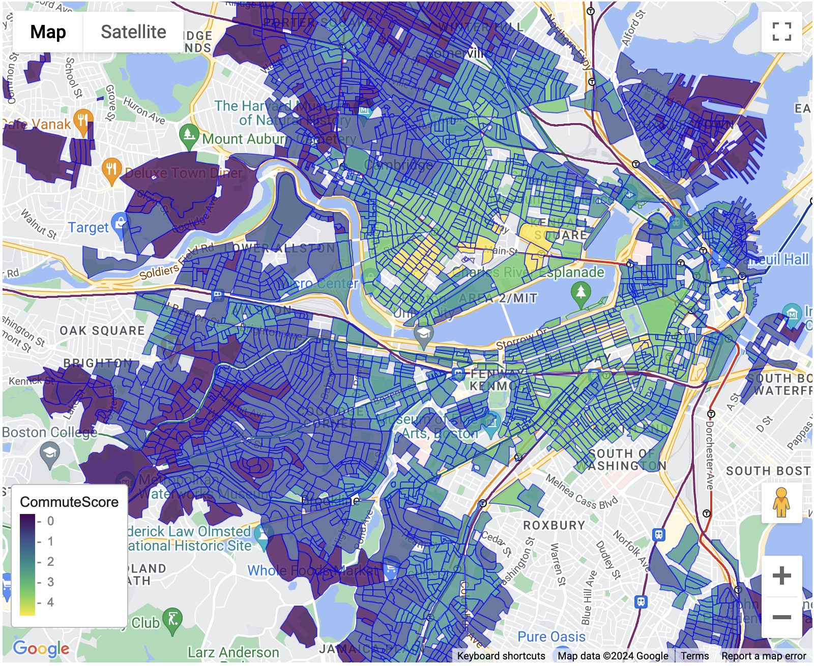
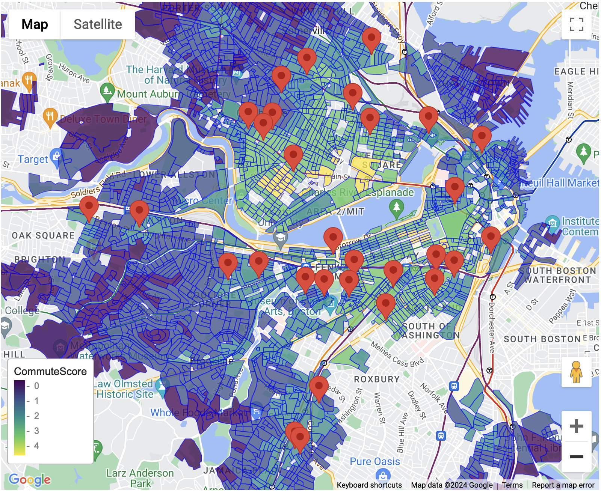
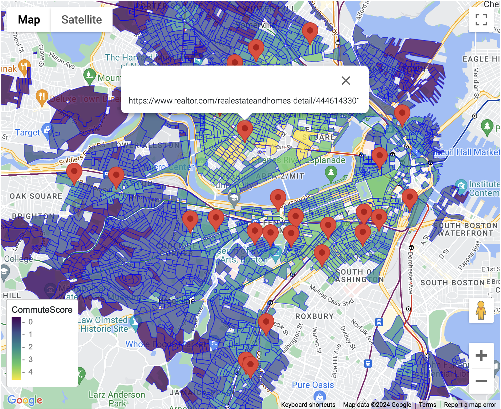

Using Google Maps via R to explore Greater Boston neighborhood housing
================
Jeremy M. Simon

- <a href="#background" id="toc-background">Background</a>
- <a href="#initial-setup" id="toc-initial-setup">Initial setup</a>
  - <a href="#load-dependencies" id="toc-load-dependencies">Load
    dependencies</a>
  - <a href="#set-private-google-maps-api"
    id="toc-set-private-google-maps-api">Set private Google Maps API</a>
  - <a href="#read-boston-mbta-data-via-gtfs"
    id="toc-read-boston-mbta-data-via-gtfs">Read Boston MBTA data via
    GTFS</a>
  - <a
    href="#set-reasonable-walking-distances-for-points-of-interest-0.75mi-and-transit-0.5mi-to-meters"
    id="toc-set-reasonable-walking-distances-for-points-of-interest-0.75mi-and-transit-0.5mi-to-meters">Set
    reasonable walking distances for points of interest (0.75mi) and transit
    (0.5mi) to meters</a>
- <a href="#prepare-and-tidy-up-mbta-transit-data"
  id="toc-prepare-and-tidy-up-mbta-transit-data">Prepare and tidy up MBTA
  transit data</a>
  - <a
    href="#get-all-mbta-rapidtransit-stops-in-the-network-separated-by-t-cr-and-bus"
    id="toc-get-all-mbta-rapidtransit-stops-in-the-network-separated-by-t-cr-and-bus">Get
    all MBTA RapidTransit stops in the network, separated by T, CR, and
    bus</a>
  - <a href="#create-lookup-function-to-pull-together-stop-names-and-lines"
    id="toc-create-lookup-function-to-pull-together-stop-names-and-lines">Create
    lookup function to pull together stop names and lines</a>
  - <a
    href="#annotate-t-stops-with-lines-then-create-walking-distance-buffer-around-each-stop"
    id="toc-annotate-t-stops-with-lines-then-create-walking-distance-buffer-around-each-stop">Annotate
    T stops with Lines, then create walking distance buffer around each
    stop</a>
  - <a
    href="#annotate-cr-stops-with-lines-then-create-walking-distance-buffer-around-each-stop"
    id="toc-annotate-cr-stops-with-lines-then-create-walking-distance-buffer-around-each-stop">Annotate
    CR stops with Lines, then create walking distance buffer around each
    stop</a>
  - <a
    href="#annotate-bus-stops-with-lines-then-create-walking-distance-buffer-around-each-stop"
    id="toc-annotate-bus-stops-with-lines-then-create-walking-distance-buffer-around-each-stop">Annotate
    bus stops with Lines, then create walking distance buffer around each
    stop</a>
- <a
  href="#prepare-census-block-information.-well-use-this-as-a-means-of-creating-tiles-around-the-greater-boston-area"
  id="toc-prepare-census-block-information.-well-use-this-as-a-means-of-creating-tiles-around-the-greater-boston-area">Prepare
  census block information. We’ll use this as a means of creating tiles
  around the greater Boston area</a>
  - <a href="#import-massachusetts-2020-census-blocks"
    id="toc-import-massachusetts-2020-census-blocks">Import Massachusetts
    2020 census blocks</a>
  - <a href="#create-a-list-of-greater-boston-area-towns"
    id="toc-create-a-list-of-greater-boston-area-towns">Create a list of
    Greater Boston area towns</a>
  - <a href="#filter-census-blocks-for-those-in-greater-boston-area-towns"
    id="toc-filter-census-blocks-for-those-in-greater-boston-area-towns">Filter
    census blocks for those in Greater Boston area towns</a>
- <a
  href="#intersect-census-blocks-with-mbta-transit-data-to-find-which-blocks-have-walkable-t-cr-and-bus-routes"
  id="toc-intersect-census-blocks-with-mbta-transit-data-to-find-which-blocks-have-walkable-t-cr-and-bus-routes">Intersect
  census blocks with MBTA transit data to find which blocks have walkable
  T, CR, and bus routes</a>
  - <a
    href="#calculate-which-census-blocks-intersect-buffered-t-cr-and-bus-stops"
    id="toc-calculate-which-census-blocks-intersect-buffered-t-cr-and-bus-stops">Calculate
    which census blocks intersect buffered T, CR, and bus stops</a>
  - <a href="#summarize-number-of-unique-t-lines-by-color-per-census-block"
    id="toc-summarize-number-of-unique-t-lines-by-color-per-census-block">Summarize
    number of unique T lines (by color) per census block</a>
  - <a href="#summarize-number-of-unique-cr-lines-per-census-block"
    id="toc-summarize-number-of-unique-cr-lines-per-census-block">Summarize
    number of unique CR lines per census block</a>
  - <a href="#summarize-number-of-unique-bus-lines-per-census-block"
    id="toc-summarize-number-of-unique-bus-lines-per-census-block">Summarize
    number of unique bus lines per census block</a>
- <a
  href="#compute-aggregated-transit-connectivity-score-per-census-block-and-plot-our-first-map"
  id="toc-compute-aggregated-transit-connectivity-score-per-census-block-and-plot-our-first-map">Compute
  aggregated transit connectivity score per census block and plot our
  first map</a>
  - <a
    href="#plot-base-map-then-color-census-blocks-by-t-connectivity-score"
    id="toc-plot-base-map-then-color-census-blocks-by-t-connectivity-score">Plot
    base map then color census blocks by T connectivity score</a>
- <a
  href="#create-a-database-of-highly-rated-points-of-interest-that-we-factor-in-for-good-livability"
  id="toc-create-a-database-of-highly-rated-points-of-interest-that-we-factor-in-for-good-livability">Create
  a database of highly-rated points-of-interest that we factor in for good
  livability</a>
  - <a
    href="#retrieve-listings-for-highly-reviewed-cafes-in-the-greater-boston-area"
    id="toc-retrieve-listings-for-highly-reviewed-cafes-in-the-greater-boston-area">Retrieve
    listings for highly-reviewed cafes in the greater Boston area</a>
    - <a href="#peek-at-result-then-buffer-by-max-walking-distance"
      id="toc-peek-at-result-then-buffer-by-max-walking-distance">Peek at
      result, then buffer by max walking distance</a>
    - <a href="#find-which-census-blocks-have-a-cafe-in-walking-distance"
      id="toc-find-which-census-blocks-have-a-cafe-in-walking-distance">Find
      which census blocks have a cafe in walking distance</a>
    - <a
      href="#summarize-number-of-cafes-found-within-walking-distance-per-block-and-create-a-binned-score-based-on-these-counts"
      id="toc-summarize-number-of-cafes-found-within-walking-distance-per-block-and-create-a-binned-score-based-on-these-counts">Summarize
      number of cafes found within walking distance per block, and create a
      binned score based on these counts</a>
    - <a href="#plot-base-map-then-color-census-blocks-by-cafe-score"
      id="toc-plot-base-map-then-color-census-blocks-by-cafe-score">Plot base
      map then color census blocks by cafe score</a>
  - <a
    href="#retrieve-listings-for-highly-reviewed-restaurants-in-the-greater-boston-area"
    id="toc-retrieve-listings-for-highly-reviewed-restaurants-in-the-greater-boston-area">Retrieve
    listings for highly-reviewed restaurants in the greater Boston area</a>
    - <a href="#peek-at-result-then-buffer-by-max-walking-distance-1"
      id="toc-peek-at-result-then-buffer-by-max-walking-distance-1">Peek at
      result, then buffer by max walking distance</a>
    - <a
      href="#find-which-census-blocks-have-a-restaurant-in-walking-distance"
      id="toc-find-which-census-blocks-have-a-restaurant-in-walking-distance">Find
      which census blocks have a restaurant in walking distance</a>
    - <a
      href="#summarize-number-of-restaurants-found-within-walking-distance-per-block-and-create-score"
      id="toc-summarize-number-of-restaurants-found-within-walking-distance-per-block-and-create-score">Summarize
      number of restaurants found within walking distance per block, and
      create score</a>
    - <a href="#plot-base-map-then-color-census-blocks-by-restaurant-score"
      id="toc-plot-base-map-then-color-census-blocks-by-restaurant-score">Plot
      base map then color census blocks by restaurant score</a>
  - <a
    href="#retrieve-listings-for-highly-reviewed-grocery-stores-in-the-greater-boston-area"
    id="toc-retrieve-listings-for-highly-reviewed-grocery-stores-in-the-greater-boston-area">Retrieve
    listings for highly-reviewed grocery stores in the greater Boston
    area</a>
    - <a href="#peek-at-result-then-buffer-by-max-walking-distance-2"
      id="toc-peek-at-result-then-buffer-by-max-walking-distance-2">Peek at
      result, then buffer by max walking distance</a>
    - <a
      href="#find-which-census-blocks-have-a-grocery-store-in-walking-distance"
      id="toc-find-which-census-blocks-have-a-grocery-store-in-walking-distance">Find
      which census blocks have a grocery store in walking distance</a>
    - <a
      href="#summarize-number-of-grocery-stores-found-within-walking-distance-per-block-and-create-score"
      id="toc-summarize-number-of-grocery-stores-found-within-walking-distance-per-block-and-create-score">Summarize
      number of grocery stores found within walking distance per block, and
      create score</a>
    - <a href="#plot-base-map-then-color-census-blocks-by-grocery-score"
      id="toc-plot-base-map-then-color-census-blocks-by-grocery-score">Plot
      base map then color census blocks by Grocery score</a>
  - <a
    href="#retrieve-listings-for-highly-reviewed-parks-and-playgrounds-in-the-greater-boston-area"
    id="toc-retrieve-listings-for-highly-reviewed-parks-and-playgrounds-in-the-greater-boston-area">Retrieve
    listings for highly-reviewed parks and playgrounds in the greater Boston
    area</a>
    - <a href="#peek-at-result-then-buffer-by-max-walking-distance-3"
      id="toc-peek-at-result-then-buffer-by-max-walking-distance-3">Peek at
      result, then buffer by max walking distance</a>
    - <a
      href="#find-which-census-blocks-have-a-park-or-playground-in-walking-distance"
      id="toc-find-which-census-blocks-have-a-park-or-playground-in-walking-distance">Find
      which census blocks have a park or playground in walking distance</a>
    - <a
      href="#summarize-number-of-parks-or-playgrounds-found-within-walking-distance-per-block-and-create-score"
      id="toc-summarize-number-of-parks-or-playgrounds-found-within-walking-distance-per-block-and-create-score">Summarize
      number of parks or playgrounds found within walking distance per block,
      and create score</a>
    - <a href="#plot-base-map-then-color-census-blocks-by-parks-score"
      id="toc-plot-base-map-then-color-census-blocks-by-parks-score">Plot base
      map then color census blocks by parks score</a>
- <a href="#compute-overall-walkability-score"
  id="toc-compute-overall-walkability-score">Compute overall walkability
  score</a>
  - <a href="#plot-base-map-then-color-census-blocks-by-walkability-score"
    id="toc-plot-base-map-then-color-census-blocks-by-walkability-score">Plot
    base map then color census blocks by walkability score</a>
- <a
  href="#compute-commute-time-from-the-centroid-of-filtered-census-blocks-to-each-of-our-workplaces-in-the-longwood-medical-area-and-mgh"
  id="toc-compute-commute-time-from-the-centroid-of-filtered-census-blocks-to-each-of-our-workplaces-in-the-longwood-medical-area-and-mgh">Compute
  commute time from the centroid of filtered census blocks to each of our
  workplaces in the Longwood Medical Area and MGH</a>
  - <a href="#set-destination-locations-and-example-departure-time"
    id="toc-set-destination-locations-and-example-departure-time">Set
    destination locations and example departure time</a>
  - <a href="#compute-centroid-of-each-census-block"
    id="toc-compute-centroid-of-each-census-block">Compute centroid of each
    census block</a>
  - <a
    href="#compute-these-in-chunks-of-25-or-fewer-splitting-into-200-bins-makes-the-max-group-size-25-here"
    id="toc-compute-these-in-chunks-of-25-or-fewer-splitting-into-200-bins-makes-the-max-group-size-25-here">Compute
    these in chunks of 25 or fewer, splitting into 200 bins makes the max
    group size &lt;25 here</a>
  - <a
    href="#create-a-binned-commute-score-where-the-shortest-max-time-in-minutes-is-highest"
    id="toc-create-a-binned-commute-score-where-the-shortest-max-time-in-minutes-is-highest">Create
    a binned commute score where the shortest max time in minutes is
    highest</a>
  - <a href="#plot-base-map-then-color-census-blocks-by-commute-score"
    id="toc-plot-base-map-then-color-census-blocks-by-commute-score">Plot
    base map then color census blocks by commute score</a>
- <a
  href="#retrieve-mls-listings-for-each-greater-boston-town-using-homeharvest"
  id="toc-retrieve-mls-listings-for-each-greater-boston-town-using-homeharvest">Retrieve
  MLS listings for each greater Boston town using HomeHarvest</a>
- <a
  href="#read-mls-results-back-into-r-then-overlay-onto-our-scored-census-blocks-and-plot"
  id="toc-read-mls-results-back-into-r-then-overlay-onto-our-scored-census-blocks-and-plot">Read
  MLS results back into R, then overlay onto our scored census blocks and
  plot</a>
  - <a href="#import-mls-results" id="toc-import-mls-results">Import MLS
    results</a>
  - <a href="#filter-mls-listings" id="toc-filter-mls-listings">Filter MLS
    listings</a>
  - <a
    href="#find-intersection-between-houses-for-sale-and-high-scoring-census-blocks-in-greater-boston"
    id="toc-find-intersection-between-houses-for-sale-and-high-scoring-census-blocks-in-greater-boston">Find
    intersection between houses for sale and high-scoring census blocks in
    greater Boston</a>
  - <a
    href="#plot-base-map-showing-commute-score.-add-pins-for-each-listed-property"
    id="toc-plot-base-map-showing-commute-score.-add-pins-for-each-listed-property">Plot
    base map showing commute score. Add pins for each listed property</a>
  - <a
    href="#prepare-a-tsv-for-export-showing-the-intersecting-properties-and-their-various-computed-features-for-filtering"
    id="toc-prepare-a-tsv-for-export-showing-the-intersecting-properties-and-their-various-computed-features-for-filtering">Prepare
    a tsv for export showing the intersecting properties and their various
    computed features for filtering</a>
- <a href="#future-ideas" id="toc-future-ideas">Future ideas</a>

# Background

We’d like to explore housing in the greater Boston area, but given the
high prices and low inventory, the number of neighborhoods each with
their own characteristics, and the tricky fact that our on-site work
locations are in different areas, we’d like a way to streamline our
search. The goal here is to locate areas from which we can still
reliably commute via public transit but also be walking distance to
neighborhood points-of-interest important to us. From there, we can find
housing listings that match various other search criteria.

Some of this was inspired by a post
[here](https://mdneuzerling.com/post/plotting-commute-times-with-r-and-google-maps/)
demonstrating that plotting commute times via Google Maps API calls in
`R` was possible. I wanted to add my own transit-connectivity index,
based on the fact that MBTA is somewhat unreliable (thus having
potential redundancy in our commute methods would be beneficial), and
then compute an overall walkability score based on this and other highly
rated points-of-interest within walking distance. The post linked above
tiled hexagons across a map of Melbourne; instead I decided to use 2020
census blocks, and their centroids, as the unit on which most of this
would be computed.

Much of this is possible thanks to two `R` packages: `googleway` and
`sf`. Things like calculating distances, computing centroids,
intersections, etc of spatial geometries are all possible in `sf` and
then interactions with the Google Maps API (e.g. getting maps
navigation, or searching for points of interest) are carried out via
`googleway`. `ggmap` is also worth a look as it makes maps functionality
work within `ggplot2`.

Lastly, I leveraged the python package
[HomeHarvest](https://github.com/Bunsly/HomeHarvest) to retrieve all
recent MLS listings in the area and overlay these as points on our map

Note and disclaimer: Google API calls can add up quickly. When you
register for an API key, review all pricing details and decide for
yourself whether and how to proceed so as to not generate a massive
bill. All maps images here are static, but when you plot via
`googleway::google_map()` they will be interactive.

# Initial setup

## Load dependencies

``` r
library(googleway)
library(tidytransit)
library(measurements)
library(lubridate)
library(sf)
library(tidyverse)
```

## Set private Google Maps API

I’ve set mine as an environment variable so I retrieve that value here

``` r
#api <- "your_private_api_key_here"
api <- Sys.getenv("GOOGLE_API")
googleway::set_key(key = api)
```

## Read Boston MBTA data via GTFS

``` r
boston_mbta <- read_gtfs("https://cdn.mbta.com/MBTA_GTFS.zip")
```

    Warning in gtfs_to_tidygtfs(g, files = files): Duplicated ids found in: fare_leg_rules
    The returned object is not a tidygtfs object, you can use as_tidygtfs() after fixing the issue.

## Set reasonable walking distances for points of interest (0.75mi) and transit (0.5mi) to meters

``` r
max_walk_meters <- floor(measurements::conv_unit(x = 0.75,from = "mi",to="m"))
max_walk_meters_transport <- floor(measurements::conv_unit(x = 0.5,from = "mi",to="m"))
```

# Prepare and tidy up MBTA transit data

## Get all MBTA RapidTransit stops in the network, separated by T, CR, and bus

``` r
t_stops <- boston_mbta$stops %>%
    dplyr::filter(zone_id == "RapidTransit") %>%
    dplyr::select(stop_id,stop_name,stop_lat,stop_lon) %>%
    dplyr::distinct(stop_id, .keep_all = TRUE)

t_stops
```

            stop_id      stop_name stop_lat  stop_lon
      1:      70061        Alewife 42.39616 -71.13997
      2: Alewife-01        Alewife 42.39616 -71.13997
      3: Alewife-02        Alewife 42.39616 -71.13997
      4:      70126 Allston Street 42.34865 -71.13788
      5:      70127 Allston Street 42.34855 -71.13736
     ---                                             
    273:      70060     Wonderland 42.41336 -70.99168
    274:      70162       Woodland 42.33270 -71.24305
    275:      70163       Woodland 42.33309 -71.24366
    276:      70124  Warren Street 42.34828 -71.14044
    277:      70125  Warren Street 42.34882 -71.14005

``` r
cr_stops <- boston_mbta$stops %>%
    dplyr::filter(zone_id == "CR-zone-1A") %>%
    dplyr::select(stop_id,stop_name,stop_lat,stop_lon) %>%
    dplyr::distinct(stop_id, .keep_all = TRUE)

cr_stops
```

               stop_id        stop_name stop_lat  stop_lon
      1: place-DB-2205        Fairmount 42.25364 -71.11927
      2:       DB-2205        Fairmount 42.25364 -71.11927
      3:    DB-2205-01        Fairmount 42.25364 -71.11927
      4:    DB-2205-02        Fairmount 42.25364 -71.11927
      5: place-DB-2222 Blue Hill Avenue 42.27147 -71.09578
     ---                                                  
    152:   NEC-2287-09    South Station 42.35114 -71.05508
    153:   NEC-2287-10    South Station 42.35103 -71.05496
    154:   NEC-2287-11    South Station 42.35103 -71.05496
    155:   NEC-2287-12    South Station 42.35074 -71.05493
    156:   NEC-2287-13    South Station 42.35074 -71.05493

``` r
bus_stops <- boston_mbta$stops %>%
    dplyr::filter(zone_id == "LocalBus" | zone_id == "ExpressBus-Downtown") %>%
    dplyr::select(stop_id,stop_name,stop_lat,stop_lon) %>%
    dplyr::distinct(stop_id, .keep_all = TRUE)

bus_stops
```

          stop_id                     stop_name stop_lat  stop_lon
       1:       1  Washington St opp Ruggles St 42.33096 -71.08275
       2:      10 Theo Glynn Way @ Newmarket Sq 42.33055 -71.06879
       3:   10000      Tremont St opp Temple Pl 42.35569 -71.06291
       4:   10003      Albany St opp Randall St 42.33159 -71.07624
       5:   10005    Albany St opp E Concord St 42.33502 -71.07128
      ---                                                         
    6771:   29013               Sullivan Square 42.38403 -71.07609
    6772:   29014               Sullivan Square 42.38392 -71.07609
    6773:    5271     Wellington Station Busway 42.40258 -71.07609
    6774:    5666                   Wood Island 42.38037 -71.02329
    6775:   15795                    Wonderland 42.41338 -70.99205

## Create lookup function to pull together stop names and lines

Which transit stops are on which lines is not as easily linked as I
expected, though it is all present in the GTFS feed. I perform a series
of joins using the logic described
[here](https://www.adventuremeng.com/post/tidytransit-linking-gtfs-stop-ids-and-routes/),
though my approach was a bit different

``` r
stop_route_lookup <- full_join(boston_mbta$routes,boston_mbta$trips) %>%
    full_join(boston_mbta$stop_times) %>%
    full_join(boston_mbta$stops) %>%
    dplyr::select(trip_id, route_id, shape_id, stop_id) %>%
    distinct()
```

    Joining with `by = join_by(route_id)`
    Joining with `by = join_by(trip_id)`
    Joining with `by = join_by(stop_id)`

## Annotate T stops with Lines, then create walking distance buffer around each stop

``` r
t_stops_withLines <- full_join(t_stops,stop_route_lookup,by="stop_id") %>% 
    dplyr::select(-stop_id,-trip_id,-shape_id) %>% 
    as_tibble() %>% 
    drop_na(route_id) %>%
    drop_na(stop_lat) %>%
    dplyr::filter(route_id != "Shuttle") %>%
    distinct()

t_stops_withLines_buffered <- st_as_sf(t_stops_withLines, coords = c("stop_lon","stop_lat"),crs = 4326) %>%
    sf::st_buffer(max_walk_meters_transport)
t_stops_withLines_buffered
```

    Simple feature collection with 293 features and 2 fields
    Geometry type: POLYGON
    Dimension:     XY
    Bounding box:  xmin: -71.26209 ymin: 42.20009 xmax: -70.9818 ymax: 42.44505
    Geodetic CRS:  WGS 84
    # A tibble: 293 × 3
       stop_name      route_id                                              geometry
     * <chr>          <chr>                                            <POLYGON [°]>
     1 Alewife        Red      ((-71.14487 42.40244, -71.14487 42.40242, -71.14504 …
     2 Allston Street Green-B  ((-71.13371 42.35524, -71.1339 42.35527, -71.13399 4…
     3 Allston Street Green-B  ((-71.13371 42.35531, -71.1338 42.35533, -71.1339 42…
     4 Amory Street   Green-B  ((-71.10902 42.35698, -71.10902 42.35705, -71.10911 …
     5 Amory Street   Green-B  ((-71.1092 42.3569, -71.1092 42.35701, -71.10939 42.…
     6 Andrew         Red      ((-71.04968 42.32591, -71.04959 42.32589, -71.04959 …
     7 Airport        Blue     ((-71.03789 42.36961, -71.03789 42.36948, -71.03771 …
     8 Aquarium       Blue     ((-71.06092 42.36243, -71.06092 42.36228, -71.06092 …
     9 Arlington      Green-B  ((-71.06157 42.34955, -71.06157 42.34962, -71.06148 …
    10 Arlington      Green-C  ((-71.06157 42.34955, -71.06157 42.34962, -71.06148 …
    # ℹ 283 more rows

## Annotate CR stops with Lines, then create walking distance buffer around each stop

``` r
cr_stops_withLines <- full_join(cr_stops,stop_route_lookup,by="stop_id") %>% 
    dplyr::select(-stop_id,-trip_id,-shape_id) %>% 
    as_tibble() %>% 
    drop_na(route_id) %>%
    drop_na(stop_lat) %>%
    dplyr::filter(route_id != "Shuttle") %>% 
    distinct()

cr_stops_withLines_buffered <- st_as_sf(cr_stops_withLines, coords = c("stop_lon","stop_lat"),crs = 4326) %>%
    sf::st_buffer(max_walk_meters_transport)
cr_stops_withLines_buffered
```

    Simple feature collection with 94 features and 2 fields
    Geometry type: POLYGON
    Dimension:     XY
    Bounding box:  xmin: -71.14968 ymin: 42.24633 xmax: -70.61722 ymax: 42.80517
    Geodetic CRS:  WGS 84
    # A tibble: 94 × 3
       stop_name        route_id                                            geometry
     * <chr>            <chr>                                          <POLYGON [°]>
     1 Fairmount        CR-Fairmount  ((-71.12898 42.25275, -71.12898 42.25268, -71…
     2 Fairmount        CR-Franklin   ((-71.12898 42.25275, -71.12898 42.25268, -71…
     3 Fairmount        CR-Providence ((-71.12898 42.25275, -71.12898 42.25268, -71…
     4 Blue Hill Avenue CR-Fairmount  ((-71.10458 42.27465, -71.10458 42.27463, -71…
     5 Blue Hill Avenue CR-Franklin   ((-71.10458 42.27465, -71.10458 42.27463, -71…
     6 Blue Hill Avenue CR-Providence ((-71.10458 42.27465, -71.10458 42.27463, -71…
     7 Morton Street    CR-Fairmount  ((-71.08506 42.27376, -71.08497 42.27374, -71…
     8 Morton Street    CR-Franklin   ((-71.08506 42.27376, -71.08497 42.27374, -71…
     9 Morton Street    CR-Providence ((-71.08506 42.27376, -71.08497 42.27374, -71…
    10 Talbot Avenue    CR-Fairmount  ((-71.08692 42.28906, -71.08692 42.28887, -71…
    # ℹ 84 more rows

## Annotate bus stops with Lines, then create walking distance buffer around each stop

``` r
bus_stops_withLines <- full_join(bus_stops,stop_route_lookup,by="stop_id") %>% 
    dplyr::select(-stop_id,-trip_id,-shape_id) %>% 
    as_tibble() %>% 
    drop_na(route_id) %>%
    drop_na(stop_lat) %>%
    distinct()

bus_stops_withLines_buffered <- st_as_sf(bus_stops_withLines, coords = c("stop_lon","stop_lat"),crs = 4326) %>%
    sf::st_buffer(max_walk_meters_transport)
bus_stops_withLines_buffered
```

    Simple feature collection with 11255 features and 2 fields
    Geometry type: POLYGON
    Dimension:     XY
    Bounding box:  xmin: -71.30106 ymin: 42.09942 xmax: -70.83522 ymax: 42.59434
    Geodetic CRS:  WGS 84
    # A tibble: 11,255 × 3
       stop_name                     route_id                               geometry
     * <chr>                         <chr>                             <POLYGON [°]>
     1 Washington St opp Ruggles St  1        ((-71.07345 42.32856, -71.07345 42.32…
     2 Washington St opp Ruggles St  8        ((-71.07345 42.32856, -71.07345 42.32…
     3 Washington St opp Ruggles St  15       ((-71.07345 42.32856, -71.07345 42.32…
     4 Washington St opp Ruggles St  19       ((-71.07345 42.32856, -71.07345 42.32…
     5 Washington St opp Ruggles St  47       ((-71.07345 42.32856, -71.07345 42.32…
     6 Washington St opp Ruggles St  171      ((-71.07345 42.32856, -71.07345 42.32…
     7 Theo Glynn Way @ Newmarket Sq 8        ((-71.06798 42.3378, -71.06816 42.337…
     8 Theo Glynn Way @ Newmarket Sq 10       ((-71.06798 42.3378, -71.06816 42.337…
     9 Theo Glynn Way @ Newmarket Sq 171      ((-71.06798 42.3378, -71.06816 42.337…
    10 Tremont St opp Temple Pl      15       ((-71.05497 42.35147, -71.05479 42.35…
    # ℹ 11,245 more rows

# Prepare census block information. We’ll use this as a means of creating tiles around the greater Boston area

## Import Massachusetts 2020 census blocks

[Retrieved from
here](https://www.mass.gov/info-details/massgis-data-2020-us-census)

``` r
mass_censusblocks <- st_read(dsn = "~/Downloads/CENSUS2020_BLK_BG_TRCT/CENSUS2020BLOCKS_POLY.shp")
```

    Reading layer `CENSUS2020BLOCKS_POLY' from data source 
      `/Users/jsimon/Downloads/CENSUS2020_BLK_BG_TRCT/CENSUS2020BLOCKS_POLY.shp' 
      using driver `ESRI Shapefile'
    Simple feature collection with 106164 features and 22 fields
    Geometry type: MULTIPOLYGON
    Dimension:     XY
    Bounding box:  xmin: 33863.75 ymin: 777634.4 xmax: 330838.8 ymax: 959743
    Projected CRS: NAD83 / Massachusetts Mainland

## Create a list of Greater Boston area towns

``` r
greater_boston_towns <- c(
    "Arlington",
    "Belmont",
    "Boston",
    "Braintree",
    "Brookline",
    "Cambridge",
    "Chelsea",
    "Everett",
    "Malden",
    "Medford",
    "Melrose",
    "Milton",
    "Newton",
    "Quincy",
    "Revere",
    "Somerville",
    "Waltham",
    "Watertown",
    "Winthrop"
    )
```

## Filter census blocks for those in Greater Boston area towns

``` r
greaterBoston_censusblocks <- mass_censusblocks[mass_censusblocks$TOWN %in% toupper(greater_boston_towns),]

# A handful of these have invalid boundaries and will cause errors later, so let's repair them
greaterBoston_censusblocks <- st_make_valid(greaterBoston_censusblocks)

# Several blocks fall over water or other unpopulated areas, so let's remove those by asserting that population as of the 2020 census has to be non-zero
greaterBoston_censusblocks <- greaterBoston_censusblocks[greaterBoston_censusblocks$POP20 > 0,]

greaterBoston_censusblocks
```

    Simple feature collection with 14449 features and 22 fields
    Geometry type: POLYGON
    Dimension:     XY
    Bounding box:  xmin: 217614.4 ymin: 879882.7 xmax: 245421.3 ymax: 914028.5
    Projected CRS: NAD83 / Massachusetts Mainland
    First 10 features:
          STATEFP20 COUNTYFP20 TRACTCE20 BLOCKCE20         GEOID20     NAME20
    51198        25        025    180101      2008 250251801012008 Block 2008
    51199        25        025    130300      3007 250251303003007 Block 3007
    51200        25        025    050700      1004 250250507001004 Block 1004
    51201        25        025    160300      2002 250251603002002 Block 2002
    51203        25        021    419400      2012 250214194002012 Block 2012
    51204        25        021    400700      3002 250214007003002 Block 3002
    51205        25        021    418101      1017 250214181011017 Block 1017
    51206        25        021    417704      2003 250214177042003 Block 2003
    51208        25        021    419602      2021 250214196022021 Block 2021
    51210        25        021    416101      3012 250214161013012 Block 3012
          MTFCC20 ALAND20 AWATER20  INTPTLAT20   INTPTLON20 HOUSING20 POP20
    51198   G5040   12243        0 +42.3885921 -070.9729859        23    57
    51199   G5040   10029        0 +42.2786967 -071.1515725        12    32
    51200   G5040   14078        0 +42.3735839 -071.0339670       121   354
    51201   G5040   31455        0 +42.3897089 -071.0452321       315   370
    51203   G5040    7006        0 +42.2291968 -070.9697674         8    30
    51204   G5040   15162        0 +42.3339984 -071.1275203        27    51
    51205   G5040   21732        0 +42.2539706 -071.0083784        38   113
    51206   G5040   29460        0 +42.2549821 -071.0044867       111   252
    51208   G5040   20846        0 +42.1739325 -071.0084655        13    40
    51210   G5040   17006        0 +42.2334696 -071.0691404        15    54
          AREA_SQFT AREA_ACRES      TOWN TOWN_ID     BLKGRP20     TRACT20 COUSUBFP
    51198 131772.95       3.03  WINTHROP     346 250251801012 25025180101    81005
    51199 107941.62       2.48    BOSTON      35 250251303003 25025130300    07000
    51200 151520.76       3.48    BOSTON      35 250250507001 25025050700    07000
    51201 338558.53       7.77   CHELSEA      57 250251603002 25025160300    13205
    51203  75409.17       1.73 BRAINTREE      40 250214194002 25021419400    07740
    51204 163192.32       3.75 BROOKLINE      46 250214007003 25021400700    09175
    51205 233902.16       5.37    QUINCY     243 250214181011 25021418101    55745
    51206 317077.43       7.28    QUINCY     243 250214177042 25021417704    55745
    51208 224364.62       5.15 BRAINTREE      40 250214196022 25021419602    07740
    51210 183032.73       4.20    MILTON     189 250214161013 25021416101    41690
          SHAPE_AREA SHAPE_LEN                       geometry
    51198  12242.156  543.5588 POLYGON ((243402.5 904425.5...
    51199  10028.145  416.8513 POLYGON ((228812 892112.3, ...
    51200  14076.795  556.6098 POLYGON ((238477.5 902727.8...
    51201  31453.243  701.0596 POLYGON ((237399.1 904332.8...
    51203   7005.769  393.1014 POLYGON ((243842.7 886675.6...
    51204  15161.123  519.5947 POLYGON ((230792.6 898286.1...
    51205  21730.308  730.1781 POLYGON ((240694.7 889295.9...
    51206  29457.575  827.4635 POLYGON ((240985.5 889522, ...
    51208  20844.239  633.6230 POLYGON ((240690.1 880524.3...
    51210  17004.365  591.8149 POLYGON ((235666.6 887046, ...

# Intersect census blocks with MBTA transit data to find which blocks have walkable T, CR, and bus routes

## Calculate which census blocks intersect buffered T, CR, and bus stops

``` r
blocks_walkToT <- greaterBoston_censusblocks %>%
    sf::st_transform(crs = 4326) %>%
    sf::st_intersects(.,t_stops_withLines_buffered)
blocks_walkToT
```

    Sparse geometry binary predicate list of length 14449, where the
    predicate was `intersects'
    first 10 elements:
     1: (empty)
     2: (empty)
     3: 7, 207
     4: (empty)
     5: (empty)
     6: 34, 39, 40, 53, 54, 65, 113, 114, 267, 268
     7: 232
     8: 232
     9: (empty)
     10: (empty)

``` r
blocks_walkToCR <- greaterBoston_censusblocks %>%
    sf::st_transform(crs = 4326) %>%
    sf::st_intersects(.,cr_stops_withLines_buffered)
blocks_walkToCR
```

    Sparse geometry binary predicate list of length 14449, where the
    predicate was `intersects'
    first 10 elements:
     1: (empty)
     2: (empty)
     3: (empty)
     4: 57, 58
     5: (empty)
     6: (empty)
     7: (empty)
     8: (empty)
     9: (empty)
     10: (empty)

``` r
blocks_walkToBus <- greaterBoston_censusblocks %>%
    sf::st_transform(crs = 4326) %>%
    sf::st_intersects(.,bus_stops_withLines_buffered)
blocks_walkToBus
```

    Sparse geometry binary predicate list of length 14449, where the
    predicate was `intersects'
    first 10 elements:
     1: 223, 224, 225, 226, 227, 268, 269, 270, 271, 290, ...
     2: 600, 6255, 6256, 6257, 6258, 6259, 6307, 6308, 6309, 6311, ...
     3: 1416, 6962, 7069, 7070, 7071, 7072, 7073, 7074, 7075, 7076, ...
     4: 1197, 1198, 1199, 1200, 1201, 1202, 1203, 1204, 1205, 1206, ...
     5: 4459, 4460, 4461, 4462, 4463, 4464, 4465, 4467, 4497, 4498, ...
     6: 787, 788, 791, 795, 796, 798, 805, 817, 822, 823, ...
     7: 849, 893, 1046, 2522, 3529, 3530, 3531, 3532, 3533, 3534, ...
     8: 3529, 3530, 3531, 3532, 3533, 3534, 3538, 3539, 3540, 3541, ...
     9: 4637, 4638, 4639, 4640, 4641, 4642, 4643, 4658, 4659, 4660, ...
     10: 4963, 4964, 4965, 4966, 4972, 4973, 4975, 4976, 5189, 5190, ...

## Summarize number of unique T lines (by color) per census block

Here we collapse all branches (-B, -C, -D, -E) of green, and call
“Mattapan” as “Red” for simplicity

Note this penalizes the Green line somewhat, given the distinct branches
west of Kenmore. However given how slow the western branches of the
Green line are, this score prioritizes having some truly rapid option
and/or other mode of transit

``` r
nLines_perBlock <- t_stops_withLines_buffered %>% 
    as_tibble() %>% 
    dplyr::select(-geometry) %>%
    mutate(RowNumber = row_number()) %>%
    mutate(route_id = str_replace_all(route_id,"-.","")) %>%
    mutate(route_id = str_replace_all(route_id,"Mattapan","Red")) %>%
    left_join(enframe(blocks_walkToT) %>% 
                unnest(cols=value,keep_empty = T),.,by=c("value" = "RowNumber")) %>% 
    group_by(name) %>%
    summarize(nLines = n_distinct(route_id,na.rm=T))
nLines_perBlock
```

    # A tibble: 14,449 × 2
        name nLines
       <int>  <int>
     1     1      0
     2     2      0
     3     3      1
     4     4      0
     5     5      0
     6     6      1
     7     7      1
     8     8      1
     9     9      0
    10    10      0
    # ℹ 14,439 more rows

``` r
# Add this annotation to our census blocks as a new column    
greaterBoston_censusblocks$numTlines <- nLines_perBlock$nLines 
```

## Summarize number of unique CR lines per census block

``` r
nCRLines_perBlock <- cr_stops_withLines_buffered %>% 
    as_tibble() %>% 
    dplyr::select(-geometry) %>%
    mutate(RowNumber = row_number()) %>%
    left_join(enframe(blocks_walkToCR) %>% 
                unnest(cols=value,keep_empty = T),.,by=c("value" = "RowNumber")) %>% 
    group_by(name) %>%
    summarize(nLines = n_distinct(route_id,na.rm=T))
nCRLines_perBlock
```

    # A tibble: 14,449 × 2
        name nLines
       <int>  <int>
     1     1      0
     2     2      0
     3     3      0
     4     4      1
     5     5      0
     6     6      0
     7     7      0
     8     8      0
     9     9      0
    10    10      0
    # ℹ 14,439 more rows

``` r
# Add this annotation to our census blocks as a new column       
greaterBoston_censusblocks$numCRlines <- nCRLines_perBlock$nLines 
```

## Summarize number of unique bus lines per census block

``` r
nBusLines_perBlock <- bus_stops_withLines_buffered %>% 
    as_tibble() %>% 
    dplyr::select(-geometry) %>%
    mutate(RowNumber = row_number()) %>%
    left_join(enframe(blocks_walkToBus) %>% 
                unnest(cols=value,keep_empty = T),.,by=c("value" = "RowNumber")) %>% 
    group_by(name) %>%
    summarize(nLines = n_distinct(route_id,na.rm=T))
nBusLines_perBlock
```

    # A tibble: 14,449 × 2
        name nLines
       <int>  <int>
     1     1      2
     2     2      4
     3     3     10
     4     4      5
     5     5      1
     6     6      3
     7     7     18
     8     8     18
     9     9      1
    10    10      1
    # ℹ 14,439 more rows

``` r
# Add this annotation to our census blocks as a new column       
greaterBoston_censusblocks$numBuslines <- nBusLines_perBlock$nLines 
```

# Compute aggregated transit connectivity score per census block and plot our first map

Scored as:

- 0: no T, CR, or bus

- 1: only one of T/CR/bus (ie relies only on one form of transit)

- 2: T and either CR or bus present

- 3: T, CR, bus all present

``` r
T_connectivity <- cbind("numTlines" = greaterBoston_censusblocks$numTlines,
        "numCRlines" = greaterBoston_censusblocks$numCRlines,
        "numBuslines" = greaterBoston_censusblocks$numBuslines
    ) %>%
    as_tibble() %>%
    mutate(Connectivity = case_when(
        (numTlines == 0) & (numCRlines == 0) & (numBuslines == 0) ~ 0,
        (numTlines > 0) & (numCRlines > 0) & (numBuslines > 0) ~ 3,
        (numTlines > 0) & ((numCRlines > 0) | (numBuslines > 0)) ~ 2,
        (numCRlines > 0) & ((numTlines > 0) | (numBuslines > 0)) ~ 2,
            ((numTlines == 0) & (numCRlines == 0)) | 
            ((numTlines == 0) & (numBuslines == 0)) | 
            ((numCRlines == 0) & (numBuslines == 0)) ~ 1,
        T ~ 999
        )
    )
T_connectivity
```

    # A tibble: 14,449 × 4
       numTlines numCRlines numBuslines Connectivity
           <int>      <int>       <int>        <dbl>
     1         0          0           2            1
     2         0          0           4            1
     3         1          0          10            2
     4         0          1           5            2
     5         0          0           1            1
     6         1          0           3            2
     7         1          0          18            2
     8         1          0          18            2
     9         0          0           1            1
    10         0          0           1            1
    # ℹ 14,439 more rows

``` r
# Check that all scored as expected
sum(T_connectivity$Connectivity==999)
```

    [1] 0

``` r
# Add Connectivity score to census block data matrix
greaterBoston_censusblocks$T_connectivity <- T_connectivity$Connectivity
```

## Plot base map then color census blocks by T connectivity score

``` r
google_map(data=t_stops) %>% 
    add_transit() %>%
    add_polygons(data = st_transform(greaterBoston_censusblocks,crs = 4326), 
        fill_colour = "T_connectivity",
        fill_opacity = 0.75,
        legend = T) 
```



# Create a database of highly-rated points-of-interest that we factor in for good livability

Here we include cafes, restaurants, parks/playgrounds, and grocery
stores. I performed these queries more by neighborhood than town, since
Google Maps retrieves results regardless for a fairly large area

## Retrieve listings for highly-reviewed cafes in the greater Boston area

Note the “coffee roaster” term is used here to try to avoid Dunkin’,
Starbucks, etc, but may miss some other good-quality cafes. Your
priorities may vary.

The `google_places` search can only retrieve 20 results at a time, so we
grab a few pages worth for each neighborhood, then merge everything
together, set a filter for star rating and a minimum number of reviews,
and remove duplicates

``` r
cafes_somerville <- google_places(search_string = "Coffee roaster in Somerville, MA",
                     key = api)
cafes_somerville_next1 <- google_places(search_string = "Coffee roaster in Somerville, MA",
                          page_token = cafes_somerville$next_page_token,
                          key = api)
cafes_somerville_next2 <- google_places(search_string = "Coffee roaster in Somerville, MA",
                          page_token = cafes_somerville_next1$next_page_token,
                          key = api)
cafes_cambridge <- google_places(search_string = "Coffee roaster in Cambridge, MA",
                     key = api)
cafes_cambridge_next1 <- google_places(search_string = "Coffee roaster in Cambridge, MA",
                          page_token = cafes_cambridge$next_page_token,
                          key = api)
cafes_cambridge_next2 <- google_places(search_string = "Coffee roaster in Cambridge, MA",
                          page_token = cafes_cambridge_next1$next_page_token,
                          key = api)
cafes_boston <- google_places(search_string = "Coffee roaster in Boston, MA",
                     key = api)
cafes_boston_next1 <- google_places(search_string = "Coffee roaster in Boston, MA",
                          page_token = cafes_boston$next_page_token,
                          key = api)
cafes_boston_next2 <- google_places(search_string = "Coffee roaster in Boston, MA",
                          page_token = cafes_boston_next1$next_page_token,
                          key = api)
cafes_brookline <- google_places(search_string = "Coffee roaster in Brookline, MA",
                     key = api)
cafes_brookline_next1 <- google_places(search_string = "Coffee roaster in Brookline, MA",
                          page_token = cafes_brookline$next_page_token,
                          key = api)
cafes_brookline_next2 <- google_places(search_string = "Coffee roaster in Brookline, MA",
                          page_token = cafes_brookline_next1$next_page_token,
                          key = api)
cafes_jp <- google_places(search_string = "Coffee roaster in Jamaica Plain, MA",
                     key = api)
cafes_jp_next1 <- google_places(search_string = "Coffee roaster in Jamaica Plain, MA",
                          page_token = cafes_jp$next_page_token,
                          key = api)
cafes_jp_next2 <- google_places(search_string = "Coffee roaster in Jamaica Plain, MA",
                          page_token = cafes_jp_next1$next_page_token,
                          key = api)
cafes_medford <- google_places(search_string = "Coffee roaster in Medford, MA",
                     key = api)
cafes_medford_next1 <- google_places(search_string = "Coffee roaster in Medford, MA",
                          page_token = cafes_medford$next_page_token,
                          key = api)
cafes_medford_next2 <- google_places(search_string = "Coffee roaster in Medford, MA",
                          page_token = cafes_medford_next1$next_page_token,
                          key = api)
cafes_belmont <- google_places(search_string = "Coffee roaster in Belmont, MA",
                     key = api)
cafes_belmont_next1 <- google_places(search_string = "Coffee roaster in Belmont, MA",
                          page_token = cafes_belmont$next_page_token,
                          key = api)
cafes_belmont_next2 <- google_places(search_string = "Coffee roaster in Belmont, MA",
                          page_token = cafes_belmont_next1$next_page_token,
                          key = api)
cafes_dorchester <- google_places(search_string = "Coffee roaster in Dorchester, MA",
                     key = api)
cafes_dorchester_next1 <- google_places(search_string = "Coffee roaster in Dorchester, MA",
                          page_token = cafes_dorchester$next_page_token,
                          key = api)
cafes_dorchester_next2 <- google_places(search_string = "Coffee roaster in Dorchester, MA",
                          page_token = cafes_dorchester_next1$next_page_token,
                          key = api)
cafes_charles <- google_places(search_string = "Coffee roaster in Charlestown, MA",
                     key = api)
cafes_charles_next1 <- google_places(search_string = "Coffee roaster in Charlestown, MA",
                          page_token = cafes_charles$next_page_token,
                          key = api)
cafes_charles_next2 <- google_places(search_string = "Coffee roaster in Charlestown, MA",
                          page_token = cafes_charles_next1$next_page_token,
                          key = api)
cafes_brighton <- google_places(search_string = "Coffee roaster in Brighton, MA",
                     key = api)
cafes_brighton_next1 <- google_places(search_string = "Coffee roaster in Brighton, MA",
                          page_token = cafes_brighton$next_page_token,
                          key = api)
cafes_brighton_next2 <- google_places(search_string = "Coffee roaster in Brighton, MA",
                          page_token = cafes_brighton_next1$next_page_token,
                          key = api)
cafes_newton <- google_places(search_string = "Coffee roaster in Newton, MA",
                     key = api)
cafes_newton_next1 <- google_places(search_string = "Coffee roaster in Newton, MA",
                          page_token = cafes_newton$next_page_token,
                          key = api)
cafes_newton_next2 <- google_places(search_string = "Coffee roaster in Newton, MA",
                          page_token = cafes_newton_next1$next_page_token,
                          key = api)
                     

cafes_merged <- cafes_somerville$results %>% 
    as_tibble() %>% 
    bind_rows(cafes_cambridge$results) %>%
    bind_rows(cafes_boston$results) %>%
    bind_rows(cafes_brookline$results) %>%
    bind_rows(cafes_jp$results) %>%
    bind_rows(cafes_medford$results) %>%
    bind_rows(cafes_belmont$results) %>%
    bind_rows(cafes_dorchester$results) %>% 
    bind_rows(cafes_charles$results) %>%
    bind_rows(cafes_brighton$results) %>%
    bind_rows(cafes_newton$results) %>%
    bind_rows(cafes_somerville_next1$results) %>%
    bind_rows(cafes_somerville_next2$results) %>%
    bind_rows(cafes_cambridge_next1$results) %>%
    bind_rows(cafes_cambridge_next2$results) %>%
    bind_rows(cafes_boston_next1$results) %>%
    bind_rows(cafes_boston_next2$results) %>%
    bind_rows(cafes_brookline_next1$results) %>%
    bind_rows(cafes_brookline_next2$results) %>%
    bind_rows(cafes_jp_next1$results) %>%
    bind_rows(cafes_jp_next2$results) %>%
    bind_rows(cafes_medford_next1$results) %>%
    bind_rows(cafes_medford_next2$results) %>%
    bind_rows(cafes_belmont_next1$results) %>%
    bind_rows(cafes_belmont_next2$results) %>%
    bind_rows(cafes_dorchester_next1$results) %>%
    bind_rows(cafes_dorchester_next2$results) %>%
    bind_rows(cafes_charles_next1$results) %>%
    bind_rows(cafes_charles_next2$results) %>%
    bind_rows(cafes_brighton_next1$results) %>%
    bind_rows(cafes_brighton_next2$results) %>%
    bind_rows(cafes_newton_next1$results) %>%
    bind_rows(cafes_newton_next2$results) %>%
    unnest(cols = geometry) %>% 
    unnest(location) %>% 
    dplyr::select(name,lat,lng,rating,user_ratings_total) %>%
    dplyr::filter(rating > 4.25 & user_ratings_total > 10) %>%
    dplyr::distinct(name, lat, lng, .keep_all=TRUE)
```

### Peek at result, then buffer by max walking distance

``` r
cafes_merged
```

    # A tibble: 110 × 5
       name                         lat   lng rating user_ratings_total
       <chr>                      <dbl> <dbl>  <dbl>              <int>
     1 Yego Coffee                 42.4 -71.1    5                  213
     2 Zaruma Gold Coffee          42.4 -71.1    4.5                208
     3 Wicked Cafe                 42.4 -71.1    4.8                 58
     4 Broadsheet Coffee Roasters  42.4 -71.1    4.6                613
     5 True Grounds                42.4 -71.1    4.5                322
     6 Nine Bar Espresso           42.4 -71.1    4.6                335
     7 Maprang Bakery & Cafe       42.4 -71.1    4.9                156
     8 Bloc Cafe                   42.4 -71.1    4.4                765
     9 Diesel Cafe                 42.4 -71.1    4.4               1277
    10 3 Little Figs               42.4 -71.1    4.7                954
    # ℹ 100 more rows

``` r
cafes_merged_buffered <- st_as_sf(cafes_merged, coords = c("lng","lat"),crs = 4326) %>%
    sf::st_buffer(max_walk_meters)
```

### Find which census blocks have a cafe in walking distance

``` r
blocks_walkToCafe <- greaterBoston_censusblocks %>%
    sf::st_transform(crs = 4326) %>%
    sf::st_intersects(.,cafes_merged_buffered)
```

### Summarize number of cafes found within walking distance per block, and create a binned score based on these counts

``` r
nCafes_perBlock <- lengths(blocks_walkToCafe) %>%
    as_tibble() %>%
    mutate(nCafe = case_when(
        value == 0 ~ 0,
        (value > 0) & (value < 3) ~ 1,
        value >= 3 ~ 2      
        )
    )
    
greaterBoston_censusblocks$nCafes <- nCafes_perBlock$nCafe
```

### Plot base map then color census blocks by cafe score

``` r
google_map(data=t_stops) %>% 
    add_transit() %>%
    add_polygons(data = st_transform(greaterBoston_censusblocks,crs = 4326), 
        fill_colour = "nCafes",
        fill_opacity = 0.75,
        legend = T) 
```



## Retrieve listings for highly-reviewed restaurants in the greater Boston area

``` r
restaurants_somerville <- google_places(search_string = "Restaurant in Somerville, MA",
                     key = api)
restaurants_somerville_next1 <- google_places(search_string = "Restaurant in Somerville, MA",
                          page_token = restaurants_somerville$next_page_token,
                          key = api)
restaurants_somerville_next2 <- google_places(search_string = "Restaurant in Somerville, MA",
                          page_token = restaurants_somerville_next1$next_page_token,
                          key = api)
restaurants_cambridge <- google_places(search_string = "Restaurant in Cambridge, MA",
                     key = api)
restaurants_cambridge_next1 <- google_places(search_string = "Restaurant in Cambridge, MA",
                          page_token = restaurants_cambridge$next_page_token,
                          key = api)
restaurants_cambridge_next2 <- google_places(search_string = "Restaurant in Cambridge, MA",
                          page_token = restaurants_cambridge_next1$next_page_token,
                          key = api)
restaurants_boston <- google_places(search_string = "Restaurant in Boston, MA",
                     key = api)
restaurants_boston_next1 <- google_places(search_string = "Restaurant in Boston, MA",
                          page_token = restaurants_boston$next_page_token,
                          key = api)
restaurants_boston_next2 <- google_places(search_string = "Restaurant in Boston, MA",
                          page_token = restaurants_boston_next1$next_page_token,
                          key = api)
restaurants_brookline <- google_places(search_string = "Restaurant in Brookline, MA",
                     key = api)
restaurants_brookline_next1 <- google_places(search_string = "Restaurant in Brookline, MA",
                          page_token = restaurants_brookline$next_page_token,
                          key = api)
restaurants_brookline_next2 <- google_places(search_string = "Restaurant in Brookline, MA",
                          page_token = restaurants_brookline_next1$next_page_token,
                          key = api)
restaurants_jp <- google_places(search_string = "Restaurant in Jamaica Plain, MA",
                     key = api)
restaurants_jp_next1 <- google_places(search_string = "Restaurant in Jamaica Plain, MA",
                          page_token = restaurants_jp$next_page_token,
                          key = api)
restaurants_jp_next2 <- google_places(search_string = "Restaurant in Jamaica Plain, MA",
                          page_token = restaurants_jp_next1$next_page_token,
                          key = api)
restaurants_medford <- google_places(search_string = "Restaurant in Medford, MA",
                     key = api)
restaurants_medford_next1 <- google_places(search_string = "Restaurant in Medford, MA",
                          page_token = restaurants_medford$next_page_token,
                          key = api)
restaurants_medford_next2 <- google_places(search_string = "Restaurant in Medford, MA",
                          page_token = restaurants_medford_next1$next_page_token,
                          key = api)
restaurants_belmont <- google_places(search_string = "Restaurant in Belmont, MA",
                     key = api)
restaurants_belmont_next1 <- google_places(search_string = "Restaurant in Belmont, MA",
                          page_token = restaurants_belmont$next_page_token,
                          key = api)
restaurants_belmont_next2 <- google_places(search_string = "Restaurant in Belmont, MA",
                          page_token = restaurants_belmont_next1$next_page_token,
                          key = api)
restaurants_dorchester <- google_places(search_string = "Restaurant in Dorchester, MA",
                     key = api)
restaurants_dorchester_next1 <- google_places(search_string = "Restaurant in Dorchester, MA",
                          page_token = restaurants_dorchester$next_page_token,
                          key = api)
restaurants_dorchester_next2 <- google_places(search_string = "Restaurant in Dorchester, MA",
                          page_token = restaurants_dorchester_next1$next_page_token,
                          key = api)
restaurants_charles <- google_places(search_string = "Restaurant in Charlestown, MA",
                     key = api)
restaurants_charles_next1 <- google_places(search_string = "Restaurant in Charlestown, MA",
                          page_token = restaurants_charles$next_page_token,
                          key = api)
restaurants_charles_next2 <- google_places(search_string = "Restaurant in Charlestown, MA",
                          page_token = restaurants_charles_next1$next_page_token,
                          key = api)
restaurants_brighton <- google_places(search_string = "Restaurant in Brighton, MA",
                     key = api)
restaurants_brighton_next1 <- google_places(search_string = "Restaurant in Brighton, MA",
                          page_token = restaurants_brighton$next_page_token,
                          key = api)
restaurants_brighton_next2 <- google_places(search_string = "Restaurant in Brighton, MA",
                          page_token = restaurants_brighton_next1$next_page_token,
                          key = api)
restaurants_newton <- google_places(search_string = "Restaurant in Newton, MA",
                     key = api)
restaurants_newton_next1 <- google_places(search_string = "Restaurant in Newton, MA",
                          page_token = restaurants_newton$next_page_token,
                          key = api)
restaurants_newton_next2 <- google_places(search_string = "Restaurant in Newton, MA",
                          page_token = restaurants_newton_next1$next_page_token,
                          key = api)
                     

restaurants_merged <- restaurants_somerville$results %>% 
    as_tibble() %>% 
    bind_rows(restaurants_cambridge$results) %>%
    bind_rows(restaurants_boston$results) %>%
    bind_rows(restaurants_brookline$results) %>%
    bind_rows(restaurants_jp$results) %>%
    bind_rows(restaurants_medford$results) %>%
    bind_rows(restaurants_belmont$results) %>%
    bind_rows(restaurants_dorchester$results) %>%   
    bind_rows(restaurants_charles$results) %>%
    bind_rows(restaurants_brighton$results) %>%
    bind_rows(restaurants_newton$results) %>%
    bind_rows(restaurants_somerville_next1$results) %>%
    bind_rows(restaurants_somerville_next2$results) %>%
    bind_rows(restaurants_cambridge_next1$results) %>%
    bind_rows(restaurants_cambridge_next2$results) %>%
    bind_rows(restaurants_boston_next1$results) %>%
    bind_rows(restaurants_boston_next2$results) %>%
    bind_rows(restaurants_brookline_next1$results) %>%
    bind_rows(restaurants_brookline_next2$results) %>%
    bind_rows(restaurants_jp_next1$results) %>%
    bind_rows(restaurants_jp_next2$results) %>%
    bind_rows(restaurants_medford_next1$results) %>%
    bind_rows(restaurants_medford_next2$results) %>%
    bind_rows(restaurants_belmont_next1$results) %>%
    bind_rows(restaurants_belmont_next2$results) %>%
    bind_rows(restaurants_dorchester_next1$results) %>%
    bind_rows(restaurants_dorchester_next2$results) %>%
    bind_rows(restaurants_charles_next1$results) %>%
    bind_rows(restaurants_charles_next2$results) %>%
    bind_rows(restaurants_brighton_next1$results) %>%
    bind_rows(restaurants_brighton_next2$results) %>%
    bind_rows(restaurants_newton_next1$results) %>%
    bind_rows(restaurants_newton_next2$results) %>%
    unnest(cols = geometry) %>% 
    unnest(location) %>% 
    dplyr::select(name,lat,lng,rating,user_ratings_total) %>%
    dplyr::filter(rating > 4 & user_ratings_total > 10) %>%
    dplyr::distinct(name, lat, lng, .keep_all=TRUE)
```

### Peek at result, then buffer by max walking distance

``` r
restaurants_merged
```

    # A tibble: 224 × 5
       name                          lat   lng rating user_ratings_total
       <chr>                       <dbl> <dbl>  <dbl>              <int>
     1 The Neighborhood Restaurant  42.4 -71.1    4.7               1435
     2 Salt + Stone                 42.4 -71.1    4.1                408
     3 Hot Tomatoes                 42.4 -71.1    4.8                 56
     4 Civility Social House        42.4 -71.1    4.7                139
     5 Highland Kitchen             42.4 -71.1    4.6               1313
     6 Josephine                    42.4 -71.1    4.2                175
     7 Sarma Restaurant             42.4 -71.1    4.7               2172
     8 Cristian Latin               42.4 -71.1    4.9                 53
     9 Trina's Starlite Lounge      42.4 -71.1    4.7                951
    10 Juliet                       42.4 -71.1    4.5                529
    # ℹ 214 more rows

``` r
restaurants_merged_buffered <- st_as_sf(restaurants_merged, coords = c("lng","lat"),crs = 4326) %>%
    sf::st_buffer(max_walk_meters)
```

### Find which census blocks have a restaurant in walking distance

``` r
blocks_walkToRestaurant <- greaterBoston_censusblocks %>%
    sf::st_transform(crs = 4326) %>%
    sf::st_intersects(.,restaurants_merged_buffered)
```

### Summarize number of restaurants found within walking distance per block, and create score

``` r
nRestaurants_perBlock <- lengths(blocks_walkToRestaurant) %>%
    as_tibble() %>%
    mutate(nRestaurants = case_when(
        value == 0 ~ 0,
        (value > 0) & (value < 3) ~ 1,
        value >= 3 ~ 2      
        )
    )
    
greaterBoston_censusblocks$nRestaurants <- nRestaurants_perBlock$nRestaurants
```

### Plot base map then color census blocks by restaurant score

``` r
google_map(data=t_stops) %>% 
    add_transit() %>%
    add_polygons(data = st_transform(greaterBoston_censusblocks,crs = 4326), 
        fill_colour = "nRestaurants",
        fill_opacity = 0.75,
        legend = T) 
```



## Retrieve listings for highly-reviewed grocery stores in the greater Boston area

``` r
grocery_somerville <- google_places(search_string = "Grocery store in Somerville, MA",
                     key = api)
grocery_somerville_next1 <- google_places(search_string = "Grocery store in Somerville, MA",
                          page_token = grocery_somerville$next_page_token,
                          key = api)
grocery_somerville_next2 <- google_places(search_string = "Grocery store in Somerville, MA",
                          page_token = grocery_somerville_next1$next_page_token,
                          key = api)
grocery_cambridge <- google_places(search_string = "Grocery store in Cambridge, MA",
                     key = api)
grocery_cambridge_next1 <- google_places(search_string = "Grocery store in Cambridge, MA",
                          page_token = grocery_cambridge$next_page_token,
                          key = api)
grocery_cambridge_next2 <- google_places(search_string = "Grocery store in Cambridge, MA",
                          page_token = grocery_cambridge_next1$next_page_token,
                          key = api)
grocery_boston <- google_places(search_string = "Grocery store in Boston, MA",
                     key = api)
grocery_boston_next1 <- google_places(search_string = "Grocery store in Boston, MA",
                          page_token = grocery_boston$next_page_token,
                          key = api)
grocery_boston_next2 <- google_places(search_string = "Grocery store in Boston, MA",
                          page_token = grocery_boston_next1$next_page_token,
                          key = api)
grocery_brookline <- google_places(search_string = "Grocery store in Brookline, MA",
                     key = api)
grocery_brookline_next1 <- google_places(search_string = "Grocery store in Brookline, MA",
                          page_token = grocery_brookline$next_page_token,
                          key = api)
grocery_brookline_next2 <- google_places(search_string = "Grocery store in Brookline, MA",
                          page_token = grocery_brookline_next1$next_page_token,
                          key = api)
grocery_jp <- google_places(search_string = "Grocery store in Jamaica Plain, MA",
                     key = api)
grocery_jp_next1 <- google_places(search_string = "Grocery store in Jamaica Plain, MA",
                          page_token = grocery_jp$next_page_token,
                          key = api)
grocery_jp_next2 <- google_places(search_string = "Grocery store in Jamaica Plain, MA",
                          page_token = grocery_jp_next1$next_page_token,
                          key = api)
grocery_medford <- google_places(search_string = "Grocery store in Medford, MA",
                     key = api)
grocery_medford_next1 <- google_places(search_string = "Grocery store in Medford, MA",
                          page_token = grocery_medford$next_page_token,
                          key = api)
grocery_medford_next2 <- google_places(search_string = "Grocery store in Medford, MA",
                          page_token = grocery_medford_next1$next_page_token,
                          key = api)
grocery_belmont <- google_places(search_string = "Grocery store in Belmont, MA",
                     key = api)
grocery_belmont_next1 <- google_places(search_string = "Grocery store in Belmont, MA",
                          page_token = grocery_belmont$next_page_token,
                          key = api)
grocery_belmont_next2 <- google_places(search_string = "Grocery store in Belmont, MA",
                          page_token = grocery_belmont_next1$next_page_token,
                          key = api)
grocery_dorchester <- google_places(search_string = "Grocery store in Dorchester, MA",
                     key = api)
grocery_dorchester_next1 <- google_places(search_string = "Grocery store in Dorchester, MA",
                          page_token = grocery_dorchester$next_page_token,
                          key = api)
grocery_dorchester_next2 <- google_places(search_string = "Grocery store in Dorchester, MA",
                          page_token = grocery_dorchester_next1$next_page_token,
                          key = api)
grocery_charles <- google_places(search_string = "Grocery store in Charlestown, MA",
                     key = api)
grocery_charles_next1 <- google_places(search_string = "Grocery store in Charlestown, MA",
                          page_token = grocery_charles$next_page_token,
                          key = api)
grocery_charles_next2 <- google_places(search_string = "Grocery store in Charlestown, MA",
                          page_token = grocery_charles_next1$next_page_token,
                          key = api)
grocery_brighton <- google_places(search_string = "Grocery store in Brighton, MA",
                     key = api)
grocery_brighton_next1 <- google_places(search_string = "Grocery store in Brighton, MA",
                          page_token = grocery_brighton$next_page_token,
                          key = api)
grocery_brighton_next2 <- google_places(search_string = "Grocery store in Brighton, MA",
                          page_token = grocery_brighton_next1$next_page_token,
                          key = api)
grocery_newton <- google_places(search_string = "Grocery store in Newton, MA",
                     key = api)
grocery_newton_next1 <- google_places(search_string = "Grocery store in Newton, MA",
                          page_token = grocery_newton$next_page_token,
                          key = api)
grocery_newton_next2 <- google_places(search_string = "Grocery store in Newton, MA",
                          page_token = grocery_newton_next1$next_page_token,
                          key = api)
                     

grocery_merged <- grocery_somerville$results %>% 
    as_tibble() %>% 
    bind_rows(grocery_cambridge$results) %>%
    bind_rows(grocery_boston$results) %>%
    bind_rows(grocery_brookline$results) %>%
    bind_rows(grocery_jp$results) %>%
    bind_rows(grocery_medford$results) %>%
    bind_rows(grocery_belmont$results) %>%
    bind_rows(grocery_dorchester$results) %>%   
    bind_rows(grocery_charles$results) %>%
    bind_rows(grocery_brighton$results) %>%
    bind_rows(grocery_newton$results) %>%
    bind_rows(grocery_somerville_next1$results) %>%
    bind_rows(grocery_somerville_next2$results) %>%
    bind_rows(grocery_cambridge_next1$results) %>%
    bind_rows(grocery_cambridge_next2$results) %>%
    bind_rows(grocery_boston_next1$results) %>%
    bind_rows(grocery_boston_next2$results) %>%
    bind_rows(grocery_brookline_next1$results) %>%
    bind_rows(grocery_brookline_next2$results) %>%
    bind_rows(grocery_jp_next1$results) %>%
    bind_rows(grocery_jp_next2$results) %>%
    bind_rows(grocery_medford_next1$results) %>%
    bind_rows(grocery_medford_next2$results) %>%
    bind_rows(grocery_belmont_next1$results) %>%
    bind_rows(grocery_belmont_next2$results) %>%
    bind_rows(grocery_dorchester_next1$results) %>%
    bind_rows(grocery_dorchester_next2$results) %>%
    bind_rows(grocery_charles_next1$results) %>%
    bind_rows(grocery_charles_next2$results) %>%
    bind_rows(grocery_brighton_next1$results) %>%
    bind_rows(grocery_brighton_next2$results) %>%
    bind_rows(grocery_newton_next1$results) %>%
    bind_rows(grocery_newton_next2$results) %>%
    unnest(cols = geometry) %>% 
    unnest(location) %>% 
    dplyr::select(name,lat,lng,rating,user_ratings_total) %>%
    dplyr::filter(rating > 4 & user_ratings_total > 10) %>%
    dplyr::distinct(name, lat, lng, .keep_all=TRUE)
```

### Peek at result, then buffer by max walking distance

``` r
grocery_merged
```

    # A tibble: 107 × 5
       name                   lat   lng rating user_ratings_total
       <chr>                <dbl> <dbl>  <dbl>              <int>
     1 Market Basket         42.4 -71.1    4.4               4433
     2 Stop & Shop           42.4 -71.1    4.2               1362
     3 Whole Foods Market    42.4 -71.1    4.3                764
     4 Neighborhood Produce  42.4 -71.1    4.9                153
     5 Wegmans               42.4 -71.1    4.5               3005
     6 Get-N-Go              42.4 -71.1    4.9                 25
     7 Broadway Marketplace  42.4 -71.1    4.1                462
     8 Shree Bombay Market   42.4 -71.1    4.3                113
     9 Whole Foods Market    42.4 -71.1    4.1                863
    10 Reliable Market       42.4 -71.1    4.5                581
    # ℹ 97 more rows

``` r
grocery_merged_buffered <- st_as_sf(grocery_merged, coords = c("lng","lat"),crs = 4326) %>%
    sf::st_buffer(max_walk_meters)
```

### Find which census blocks have a grocery store in walking distance

``` r
blocks_walkToGrocery <- greaterBoston_censusblocks %>%
    sf::st_transform(crs = 4326) %>%
    sf::st_intersects(.,grocery_merged_buffered)
```

### Summarize number of grocery stores found within walking distance per block, and create score

``` r
nGrocery_perBlock <- lengths(blocks_walkToGrocery) %>%
    as_tibble() %>%
    mutate(nGrocery = case_when(
        value == 0 ~ 0,
        (value > 0) & (value < 3) ~ 1,
        value >= 3 ~ 2      
        )
    )
    
greaterBoston_censusblocks$nGrocery <- nGrocery_perBlock$nGrocery
```

### Plot base map then color census blocks by Grocery score

``` r
google_map(data=t_stops) %>% 
    add_transit() %>%
    add_polygons(data = st_transform(greaterBoston_censusblocks,crs = 4326), 
        fill_colour = "nGrocery",
        fill_opacity = 0.75,
        legend = T) 
```



## Retrieve listings for highly-reviewed parks and playgrounds in the greater Boston area

``` r
parks_somerville <- google_places(search_string = "Parks and playgrounds in Somerville, MA",
                     key = api)
parks_somerville_next1 <- google_places(search_string = "Parks and playgrounds in Somerville, MA",
                          page_token = parks_somerville$next_page_token,
                          key = api)
parks_somerville_next2 <- google_places(search_string = "Parks and playgrounds in Somerville, MA",
                          page_token = parks_somerville_next1$next_page_token,
                          key = api)
parks_cambridge <- google_places(search_string = "Parks and playgrounds in Cambridge, MA",
                     key = api)
parks_cambridge_next1 <- google_places(search_string = "Parks and playgrounds in Cambridge, MA",
                          page_token = parks_cambridge$next_page_token,
                          key = api)
parks_cambridge_next2 <- google_places(search_string = "Parks and playgrounds in Cambridge, MA",
                          page_token = parks_cambridge_next1$next_page_token,
                          key = api)
parks_boston <- google_places(search_string = "Parks and playgrounds in Boston, MA",
                     key = api)
parks_boston_next1 <- google_places(search_string = "Parks and playgrounds in Boston, MA",
                          page_token = parks_boston$next_page_token,
                          key = api)
parks_boston_next2 <- google_places(search_string = "Parks and playgrounds in Boston, MA",
                          page_token = parks_boston_next1$next_page_token,
                          key = api)
parks_brookline <- google_places(search_string = "Parks and playgrounds in Brookline, MA",
                     key = api)
parks_brookline_next1 <- google_places(search_string = "Parks and playgrounds in Brookline, MA",
                          page_token = parks_brookline$next_page_token,
                          key = api)
parks_brookline_next2 <- google_places(search_string = "Parks and playgrounds in Brookline, MA",
                          page_token = parks_brookline_next1$next_page_token,
                          key = api)
parks_jp <- google_places(search_string = "Parks and playgrounds in Jamaica Plain, MA",
                     key = api)
parks_jp_next1 <- google_places(search_string = "Parks and playgrounds in Jamaica Plain, MA",
                          page_token = parks_jp$next_page_token,
                          key = api)
parks_jp_next2 <- google_places(search_string = "Parks and playgrounds in Jamaica Plain, MA",
                          page_token = parks_jp_next1$next_page_token,
                          key = api)
parks_medford <- google_places(search_string = "Parks and playgrounds in Medford, MA",
                     key = api)
parks_medford_next1 <- google_places(search_string = "Parks and playgrounds in Medford, MA",
                          page_token = parks_medford$next_page_token,
                          key = api)
parks_medford_next2 <- google_places(search_string = "Parks and playgrounds in Medford, MA",
                          page_token = parks_medford_next1$next_page_token,
                          key = api)
parks_belmont <- google_places(search_string = "Parks and playgrounds in Belmont, MA",
                     key = api)
parks_belmont_next1 <- google_places(search_string = "Parks and playgrounds in Belmont, MA",
                          page_token = parks_belmont$next_page_token,
                          key = api)
parks_belmont_next2 <- google_places(search_string = "Parks and playgrounds in Belmont, MA",
                          page_token = parks_belmont_next1$next_page_token,
                          key = api)
parks_dorchester <- google_places(search_string = "Parks and playgrounds in Dorchester, MA",
                     key = api)
parks_dorchester_next1 <- google_places(search_string = "Parks and playgrounds in Dorchester, MA",
                          page_token = parks_dorchester$next_page_token,
                          key = api)
parks_dorchester_next2 <- google_places(search_string = "Parks and playgrounds in Dorchester, MA",
                          page_token = parks_dorchester_next1$next_page_token,
                          key = api)
parks_charles <- google_places(search_string = "Parks and playgrounds in Charlestown, MA",
                     key = api)
parks_charles_next1 <- google_places(search_string = "Parks and playgrounds in Charlestown, MA",
                          page_token = parks_charles$next_page_token,
                          key = api)
parks_charles_next2 <- google_places(search_string = "Parks and playgrounds in Charlestown, MA",
                          page_token = parks_charles_next1$next_page_token,
                          key = api)
parks_brighton <- google_places(search_string = "Parks and playgrounds in Brighton, MA",
                     key = api)
parks_brighton_next1 <- google_places(search_string = "Parks and playgrounds in Brighton, MA",
                          page_token = parks_brighton$next_page_token,
                          key = api)
parks_brighton_next2 <- google_places(search_string = "Parks and playgrounds in Brighton, MA",
                          page_token = parks_brighton_next1$next_page_token,
                          key = api)
parks_newton <- google_places(search_string = "Parks and playgrounds in Newton, MA",
                     key = api)
parks_newton_next1 <- google_places(search_string = "Parks and playgrounds in Newton, MA",
                          page_token = parks_newton$next_page_token,
                          key = api)
parks_newton_next2 <- google_places(search_string = "Parks and playgrounds in Newton, MA",
                          page_token = parks_newton_next1$next_page_token,
                          key = api)
                     

parks_merged <- parks_somerville$results %>% 
    as_tibble() %>% 
    bind_rows(parks_cambridge$results) %>%
    bind_rows(parks_boston$results) %>%
    bind_rows(parks_brookline$results) %>%
    bind_rows(parks_jp$results) %>%
    bind_rows(parks_medford$results) %>%
    bind_rows(parks_belmont$results) %>%
    bind_rows(parks_dorchester$results) %>% 
    bind_rows(parks_charles$results) %>%
    bind_rows(parks_brighton$results) %>%
    bind_rows(parks_newton$results) %>%
    bind_rows(parks_somerville_next1$results) %>%
    bind_rows(parks_somerville_next2$results) %>%
    bind_rows(parks_cambridge_next1$results) %>%
    bind_rows(parks_cambridge_next2$results) %>%
    bind_rows(parks_boston_next1$results) %>%
    bind_rows(parks_boston_next2$results) %>%
    bind_rows(parks_brookline_next1$results) %>%
    bind_rows(parks_brookline_next2$results) %>%
    bind_rows(parks_jp_next1$results) %>%
    bind_rows(parks_jp_next2$results) %>%
    bind_rows(parks_medford_next1$results) %>%
    bind_rows(parks_medford_next2$results) %>%
    bind_rows(parks_belmont_next1$results) %>%
    bind_rows(parks_belmont_next2$results) %>%
    bind_rows(parks_dorchester_next1$results) %>%
    bind_rows(parks_dorchester_next2$results) %>%
    bind_rows(parks_charles_next1$results) %>%
    bind_rows(parks_charles_next2$results) %>%
    bind_rows(parks_brighton_next1$results) %>%
    bind_rows(parks_brighton_next2$results) %>%
    bind_rows(parks_newton_next1$results) %>%
    bind_rows(parks_newton_next2$results) %>%
    unnest(cols = geometry) %>% 
    unnest(location) %>% 
    dplyr::select(name,lat,lng,rating,user_ratings_total) %>%
    dplyr::filter(rating > 4 & user_ratings_total > 10) %>%
    dplyr::distinct(name, lat, lng, .keep_all=TRUE)
```

### Peek at result, then buffer by max walking distance

``` r
parks_merged
```

    # A tibble: 167 × 5
       name                               lat   lng rating user_ratings_total
       <chr>                            <dbl> <dbl>  <dbl>              <int>
     1 Sylvester Baxter Riverfront Park  42.4 -71.1    4.6                540
     2 Hoyt-Sullivan Playground          42.4 -71.1    4.7                 92
     3 Dickerman Playground              42.4 -71.1    4.7                 47
     4 Lincoln Park                      42.4 -71.1    4.8                547
     5 Seven Hills Park                  42.4 -71.1    4.2                 99
     6 Morse-Kelley Playground           42.4 -71.1    4.6                 35
     7 Glen Park                         42.4 -71.1    4.6                 48
     8 Conway Park                       42.4 -71.1    4.4                124
     9 Albion Playground                 42.4 -71.1    4.6                116
    10 Prospect Hill Park                42.4 -71.1    4.6                337
    # ℹ 157 more rows

``` r
parks_merged_buffered <- st_as_sf(parks_merged, coords = c("lng","lat"),crs = 4326) %>%
    sf::st_buffer(max_walk_meters)
```

### Find which census blocks have a park or playground in walking distance

``` r
blocks_walkToParks <- greaterBoston_censusblocks %>%
    sf::st_transform(crs = 4326) %>%
    sf::st_intersects(.,parks_merged_buffered)
```

### Summarize number of parks or playgrounds found within walking distance per block, and create score

``` r
nParks_perBlock <- lengths(blocks_walkToParks) %>%
    as_tibble() %>%
    mutate(nParks = case_when(
        value == 0 ~ 0,
        (value > 0) & (value < 3) ~ 1,
        value >= 3 ~ 2      
        )
    )
    
greaterBoston_censusblocks$nParks <- nParks_perBlock$nParks
```

### Plot base map then color census blocks by parks score

``` r
google_map(data=t_stops) %>% 
    add_transit() %>%
    add_polygons(data = st_transform(greaterBoston_censusblocks,crs = 4326), 
        fill_colour = "nParks",
        fill_opacity = 0.75,
        legend = T) 
```



# Compute overall walkability score

This is the sum of the T connectivity score above, as well as the
density scores we calculated for cafes, restaurants, groceries, and
parks within reasonable walking distance. This intentionally weights the
T-connectivity score slightly, since accessibility via public transport
is important to us.

``` r
walkabilityScore <- cbind("T_connectivity" = greaterBoston_censusblocks$T_connectivity,
                            "nCafes" = greaterBoston_censusblocks$nCafes,
                            "nRestaurants" = greaterBoston_censusblocks$nRestaurants,
                            "nGrocery" = greaterBoston_censusblocks$nGrocery,
                            "nParks" = greaterBoston_censusblocks$nParks
    ) %>%
    as_tibble() %>%
    rowwise() %>%
    mutate(walkability = sum(T_connectivity,nCafes,nRestaurants,nGrocery,nParks))

walkabilityScore
```

    # A tibble: 14,449 × 6
    # Rowwise: 
       T_connectivity nCafes nRestaurants nGrocery nParks walkability
                <dbl>  <dbl>        <dbl>    <dbl>  <dbl>       <dbl>
     1              1      0            0        0      0           1
     2              1      1            0        1      0           3
     3              2      0            0        1      2           5
     4              2      0            0        1      1           4
     5              1      0            0        0      0           1
     6              2      2            2        2      2          10
     7              2      0            0        0      0           2
     8              2      0            0        0      0           2
     9              1      0            0        0      0           1
    10              1      0            0        0      0           1
    # ℹ 14,439 more rows

``` r
greaterBoston_censusblocks$walkabilityScore <- walkabilityScore$walkability
```

## Plot base map then color census blocks by walkability score

``` r
google_map(data=t_stops) %>% 
    add_transit() %>%
    add_polygons(data = st_transform(greaterBoston_censusblocks,crs = 4326), 
        fill_colour = "walkabilityScore",
        fill_opacity = 0.75,
        legend = T) 
```



# Compute commute time from the centroid of filtered census blocks to each of our workplaces in the Longwood Medical Area and MGH

## Set destination locations and example departure time

``` r
work1 <- "3 Blackfan Street, Boston, MA"
work2 <- "55 Fruit St, Boston, MA"

monday_morning <- as.POSIXct("2024-07-08 09:00:00", tz = "America/New_York")
```

## Compute centroid of each census block

Optionally, first filter our census blocks by various criteria to cut
down on number of API calls. Doing this many times can create a large
bill, so plan and filter accordingly. Here I require a minimum
walkability score of 9 to proceed

``` r
census_centroids <- greaterBoston_censusblocks[greaterBoston_censusblocks$walkabilityScore>=9,] %>%
    sf::st_transform(crs = 4326) %>%
    sf::st_centroid() %>% 
    sf::st_coordinates()
```

    Warning: st_centroid assumes attributes are constant over geometries

## Compute these in chunks of 25 or fewer, splitting into 200 bins makes the max group size \<25 here

``` r
census_centroids_chunks <- as.data.frame(census_centroids) %>%
    as_tibble() %>%
    mutate(Chunk = ntile(n=200)) %>%
    dplyr::select(Y,X,Chunk) %>%
    group_split(Chunk,.keep=F)
    
commuteTimes <- list()
maxCommutes <- list()

for(i in 1:length(census_centroids_chunks)) {
    commuteTimes[[i]] <- googleway::google_distance(
        origins = census_centroids_chunks[[i]],
        destinations = c(work1, work2),
        mode = "transit",
        arrival_time = monday_morning,
        units = "imperial",
        transit_routing_preference = "fewer_transfers",
        traffic_model = "best_guess",
        key = api
    )

    maxCommutes[[i]] <- enframe(commuteTimes[[i]]$rows$elements) %>% 
        unnest(cols=value) %>% 
        unnest(cols=duration) %>% 
        dplyr::select(name,value) %>% 
        mutate(CommuteTime = value/60) %>%
        group_by(name) %>% 
        summarize(MaxCommute = max(CommuteTime))

}
```

## Create a binned commute score where the shortest max time in minutes is highest

``` r
maxCommutesFlat <- enframe(maxCommutes) %>% 
    dplyr::rename("Chunk" = name) %>% 
    unnest(cols=c(value)) %>%
    mutate(MaxCommute = round(MaxCommute)) %>%
    mutate(CommuteScore = case_when(
        MaxCommute >= 55 ~ 0,
        MaxCommute >= 45 & MaxCommute < 55 ~ 1,
        MaxCommute >= 35 & MaxCommute < 45 ~ 2,
        MaxCommute >= 25 & MaxCommute < 35 ~ 3,
        MaxCommute < 25 ~ 4
        )
    )
maxCommutesFlat
```

    # A tibble: 3,519 × 4
       Chunk  name MaxCommute CommuteScore
       <int> <int>      <dbl>        <dbl>
     1     1     1         47            1
     2     1     2         24            4
     3     1     3         56            0
     4     1     4         55            0
     5     1     5         38            2
     6     1     6         31            3
     7     1     7         56            0
     8     1     8         30            3
     9     1     9         42            2
    10     1    10         29            3
    # ℹ 3,509 more rows

``` r
# Add these scores to our census blocks data matrix
filtered_blocks <- greaterBoston_censusblocks[greaterBoston_censusblocks$walkabilityScore>=9,]
filtered_blocks <- filtered_blocks[filtered_blocks$POP20 > 0,]
filtered_blocks$CommuteScore <- maxCommutesFlat$CommuteScore
```

## Plot base map then color census blocks by commute score

``` r
google_map(data=t_stops) %>% 
    add_transit() %>%
    add_polygons(data = st_transform(filtered_blocks,crs = 4326), 
        fill_colour = "CommuteScore",
        fill_opacity = 0.75,
        legend = T) 
```



# Retrieve MLS listings for each greater Boston town using [HomeHarvest](https://github.com/Bunsly/HomeHarvest)

This is a `python` package that is easy to set up and run; it pulls
listings from `Realtor.com` and we create a csv tabulating each
Boston-area town’s for-sale listings within the last 30 days

``` python
from homeharvest import scrape_property
from datetime import datetime
current_timestamp = datetime.now().strftime("%Y%m%d_%H%M%S")

Arlington_filename = f"HomeHarvest_Arlington_{current_timestamp}.csv"
Arlington_properties = scrape_property(
  location="Arlington, MA",
  listing_type="for_sale",
  past_days=30
)
Arlington_properties.to_csv(Arlington_filename, index=False)


Belmont_filename = f"HomeHarvest_Belmont_{current_timestamp}.csv"
Belmont_properties = scrape_property(
  location="Belmont, MA",
  listing_type="for_sale",
  past_days=30
)
Belmont_properties.to_csv(Belmont_filename, index=False)


Boston_filename = f"HomeHarvest_Boston_{current_timestamp}.csv"
Boston_properties = scrape_property(
  location="Boston, MA",
  listing_type="for_sale",
  past_days=30
)
Boston_properties.to_csv(Boston_filename, index=False)


Braintree_filename = f"HomeHarvest_Braintree_{current_timestamp}.csv"
Braintree_properties = scrape_property(
  location="Braintree, MA",
  listing_type="for_sale",
  past_days=30
)
Braintree_properties.to_csv(Braintree_filename, index=False)


Brookline_filename = f"HomeHarvest_Brookline_{current_timestamp}.csv"
Brookline_properties = scrape_property(
  location="Brookline, MA",
  listing_type="for_sale",
  past_days=30
)
Brookline_properties.to_csv(Brookline_filename, index=False)


Cambridge_filename = f"HomeHarvest_Cambridge_{current_timestamp}.csv"
Cambridge_properties = scrape_property(
  location="Cambridge, MA",
  listing_type="for_sale",
  past_days=30
)
Cambridge_properties.to_csv(Cambridge_filename, index=False)


Chelsea_filename = f"HomeHarvest_Chelsea_{current_timestamp}.csv"
Chelsea_properties = scrape_property(
  location="Chelsea, MA",
  listing_type="for_sale",
  past_days=30
)
Chelsea_properties.to_csv(Chelsea_filename, index=False)


Everett_filename = f"HomeHarvest_Everett_{current_timestamp}.csv"
Everett_properties = scrape_property(
  location="Everett, MA",
  listing_type="for_sale",
  past_days=30
)
Everett_properties.to_csv(Everett_filename, index=False)


Malden_filename = f"HomeHarvest_Malden_{current_timestamp}.csv"
Malden_properties = scrape_property(
  location="Malden, MA",
  listing_type="for_sale",
  past_days=30
)
Malden_properties.to_csv(Malden_filename, index=False)


Medford_filename = f"HomeHarvest_Medford_{current_timestamp}.csv"
Medford_properties = scrape_property(
  location="Medford, MA",
  listing_type="for_sale",
  past_days=30
)
Medford_properties.to_csv(Medford_filename, index=False)


Melrose_filename = f"HomeHarvest_Melrose_{current_timestamp}.csv"
Melrose_properties = scrape_property(
  location="Melrose, MA",
  listing_type="for_sale",
  past_days=30
)
Melrose_properties.to_csv(Melrose_filename, index=False)


Milton_filename = f"HomeHarvest_Milton_{current_timestamp}.csv"
Milton_properties = scrape_property(
  location="Milton, MA",
  listing_type="for_sale",
  past_days=30
)
Milton_properties.to_csv(Milton_filename, index=False)


Newton_filename = f"HomeHarvest_Newton_{current_timestamp}.csv"
Newton_properties = scrape_property(
  location="Newton, MA",
  listing_type="for_sale",
  past_days=30
)
Newton_properties.to_csv(Newton_filename, index=False)


Quincy_filename = f"HomeHarvest_Quincy_{current_timestamp}.csv"
Quincy_properties = scrape_property(
  location="Quincy, MA",
  listing_type="for_sale",
  past_days=30
)
Quincy_properties.to_csv(Quincy_filename, index=False)


Revere_filename = f"HomeHarvest_Revere_{current_timestamp}.csv"
Revere_properties = scrape_property(
  location="Revere, MA",
  listing_type="for_sale",
  past_days=30
)
Revere_properties.to_csv(Revere_filename, index=False)


Somerville_filename = f"HomeHarvest_Somerville_{current_timestamp}.csv"
Somerville_properties = scrape_property(
  location="Somerville, MA",
  listing_type="for_sale",
  past_days=30
)
Somerville_properties.to_csv(Somerville_filename, index=False)


Waltham_filename = f"HomeHarvest_Waltham_{current_timestamp}.csv"
Waltham_properties = scrape_property(
  location="Waltham, MA",
  listing_type="for_sale",
  past_days=30
)
Waltham_properties.to_csv(Waltham_filename, index=False)


Watertown_filename = f"HomeHarvest_Watertown_{current_timestamp}.csv"
Watertown_properties = scrape_property(
  location="Watertown, MA",
  listing_type="for_sale",
  past_days=30
)
Watertown_properties.to_csv(Watertown_filename, index=False)


Winthrop_filename = f"HomeHarvest_Winthrop_{current_timestamp}.csv"
Winthrop_properties = scrape_property(
  location="Winthrop, MA",
  listing_type="for_sale",
  past_days=30
)
Winthrop_properties.to_csv(Winthrop_filename, index=False)
```

# Read MLS results back into R, then overlay onto our scored census blocks and plot

## Import MLS results

``` r
file.list <- list.files(pattern="HomeHarvest_*")
df.list <- lapply(file.list, function(x){read_csv(x) %>% mutate(mls_id = as.character(mls_id))})
mls_df <- bind_rows(df.list, .id = "id")

mls_df
```

    # A tibble: 1,021 × 44
       id    property_url    mls   mls_id status text  style full_street_line street
       <chr> <chr>           <chr> <chr>  <chr>  <chr> <chr> <chr>            <chr> 
     1 1     https://www.re… BSMA  73255… PENDI… Enjo… COND… 990 Massachuset… 990 M…
     2 1     https://www.re… BSMA  73255… PENDI… Welc… COND… 38 Tanager St U… 38 Ta…
     3 1     https://www.re… BSMA  73252… PENDI… East… COND… 57 Wyman Ter Un… 57 Wy…
     4 1     https://www.re… BSMA  73259… FOR_S… Inve… MULT… 37 Westminster … 37 We…
     5 1     https://www.re… BSMA  73257… FOR_S… Luxu… COND… 17 Mount Vernon… 17 Mo…
     6 1     https://www.re… BSMA  73255… FOR_S… Anno… COND… 1025 Massachuse… 1025 …
     7 1     https://www.re… BSMA  73255… PENDI… A na… SING… 251 Sylvia St    251 S…
     8 1     https://www.re… BSMA  73255… PENDI… The … COND… 5 Colonial Vill… 5 Col…
     9 1     https://www.re… BSMA  73255… FOR_S… Anno… COND… 1025 Massachuse… 1025 …
    10 1     https://www.re… BSMA  73253… FOR_S… Loca… MULT… 7 Park Ave Ext   7 Par…
    # ℹ 1,011 more rows
    # ℹ 35 more variables: unit <chr>, city <chr>, state <chr>, zip_code <chr>,
    #   beds <dbl>, full_baths <dbl>, half_baths <dbl>, sqft <dbl>,
    #   year_built <dbl>, days_on_mls <dbl>, list_price <dbl>, list_date <date>,
    #   sold_price <dbl>, last_sold_date <date>, assessed_value <dbl>,
    #   estimated_value <dbl>, lot_sqft <dbl>, price_per_sqft <dbl>,
    #   latitude <dbl>, longitude <dbl>, neighborhoods <chr>, county <chr>, …

## Filter MLS listings

Here we set a filter for 2-4 bedrooms for sale listed under \$1.5M as an
example query

``` r
mls_filtered <- mls_df %>%
    dplyr::filter(status == "FOR_SALE") %>%
    dplyr::filter(beds >= 2 & beds <=4) %>%
    dplyr::filter(list_price <= 1500000) %>%
    dplyr::select(mls_id,property_url,full_street_line,city,zip_code,beds,full_baths,half_baths,sqft,list_price,latitude,longitude)

mls_filtered
```

    # A tibble: 407 × 12
       mls_id   property_url        full_street_line city  zip_code  beds full_baths
       <chr>    <chr>               <chr>            <chr> <chr>    <dbl>      <dbl>
     1 73257275 https://www.realto… 17 Mount Vernon… Arli… 02476        3          3
     2 73255813 https://www.realto… 1025 Massachuse… Arli… 02476        2          2
     3 73253422 https://www.realto… 7 Park Ave Ext   Arli… 02724        4          2
     4 73258441 https://www.realto… 31 Surry Rd Uni… Arli… 02476        4          2
     5 73254782 https://www.realto… 56 Wyman St Uni… Arli… 02474        2          1
     6 73258370 https://www.realto… 5 Mystic Lake D… Arli… 02474        3          4
     7 73254860 https://www.realto… 176 Park Ave Un… Arli… 02476        2          1
     8 73258983 https://www.realto… 17 Mount Vernon… Arli… 02478        3          3
     9 73258412 https://www.realto… 1025 Massachuse… Arli… 02476        3          2
    10 73257584 https://www.realto… 279 Channing Rd  Belm… 02478        3          2
    # ℹ 397 more rows
    # ℹ 5 more variables: half_baths <dbl>, sqft <dbl>, list_price <dbl>,
    #   latitude <dbl>, longitude <dbl>

## Find intersection between houses for sale and high-scoring census blocks in greater Boston

Require additionally here that the census block has a high commute score

``` r
mls_intersection <- mls_filtered %>%
    sf::st_as_sf(coords = c("longitude","latitude"),crs = 4326) %>%
    sf::st_intersection(.,st_transform(filtered_blocks[filtered_blocks$CommuteScore>=2,],crs = 4326))
```

    Warning: attribute variables are assumed to be spatially constant throughout
    all geometries

``` r
mls_intersection
```

    Simple feature collection with 31 features and 42 fields
    Geometry type: POINT
    Dimension:     XY
    Bounding box:  xmin: -71.14921 ymin: 42.31591 xmax: -71.05728 ymax: 42.38341
    Geodetic CRS:  WGS 84
    # A tibble: 31 × 43
       mls_id   property_url        full_street_line city  zip_code  beds full_baths
     * <chr>    <chr>               <chr>            <chr> <chr>    <dbl>      <dbl>
     1 73258788 https://www.realto… 15 Trowbridge S… Camb… 02138        2          1
     2 73254345 https://www.realto… 52 Franklin St … Some… 02145        2          2
     3 73252063 https://www.realto… 140 Shawmut Ave… Bost… 02118        2          2
     4 73257304 https://www.realto… 214 Market St A… Bost… 02135        3          2
     5 73250779 https://www.realto… 176 School St U… Bost… 02119        3          2
     6 73249889 https://www.realto… 12 Stoneholm St… Bost… 02115        2          2
     7 73255101 https://www.realto… 1070 Beacon St … Broo… 02446        2          1
     8 73253643 https://www.realto… 18 South St Apt… Some… 02143        2          1
     9 73257692 https://www.realto… 108 Peterboroug… Bost… 02215        2          1
    10 73253842 https://www.realto… 40 Browne St Ap… Broo… 02446        2          1
    # ℹ 21 more rows
    # ℹ 36 more variables: half_baths <dbl>, sqft <dbl>, list_price <dbl>,
    #   STATEFP20 <chr>, COUNTYFP20 <chr>, TRACTCE20 <chr>, BLOCKCE20 <chr>,
    #   GEOID20 <chr>, NAME20 <chr>, MTFCC20 <chr>, ALAND20 <dbl>, AWATER20 <dbl>,
    #   INTPTLAT20 <chr>, INTPTLON20 <chr>, HOUSING20 <dbl>, POP20 <dbl>,
    #   AREA_SQFT <dbl>, AREA_ACRES <dbl>, TOWN <chr>, TOWN_ID <int>,
    #   BLKGRP20 <chr>, TRACT20 <chr>, COUSUBFP <chr>, SHAPE_AREA <dbl>, …

## Plot base map showing commute score. Add pins for each listed property

The URL to the underlying MLS listing appears when you click on a pin

``` r
google_map(data=t_stops) %>% 
    add_transit() %>%
    add_polygons(data = st_transform(filtered_blocks,crs = 4326), 
                 fill_colour = "CommuteScore",
                 fill_opacity = 0.75,
                 legend = T) %>%
    add_markers(data=mls_intersection, title="list_price", info_window="property_url")
```





## Prepare a tsv for export showing the intersecting properties and their various computed features for filtering

``` r
mls_intersection_forExport <- mls_intersection %>%
    as_tibble() %>%
    dplyr::select(mls_id,
                    property_url,
                    full_street_line,
                    city,
                    zip_code,
                    beds,
                    full_baths,
                    half_baths,
                    sqft,
                    list_price,
                    T_connectivity,
                    nCafes,
                    nRestaurants,
                    nGrocery,
                    nParks,
                    walkabilityScore,
                    CommuteScore
            )
mls_intersection_forExport
```

    # A tibble: 31 × 17
       mls_id   property_url        full_street_line city  zip_code  beds full_baths
       <chr>    <chr>               <chr>            <chr> <chr>    <dbl>      <dbl>
     1 73258788 https://www.realto… 15 Trowbridge S… Camb… 02138        2          1
     2 73254345 https://www.realto… 52 Franklin St … Some… 02145        2          2
     3 73252063 https://www.realto… 140 Shawmut Ave… Bost… 02118        2          2
     4 73257304 https://www.realto… 214 Market St A… Bost… 02135        3          2
     5 73250779 https://www.realto… 176 School St U… Bost… 02119        3          2
     6 73249889 https://www.realto… 12 Stoneholm St… Bost… 02115        2          2
     7 73255101 https://www.realto… 1070 Beacon St … Broo… 02446        2          1
     8 73253643 https://www.realto… 18 South St Apt… Some… 02143        2          1
     9 73257692 https://www.realto… 108 Peterboroug… Bost… 02215        2          1
    10 73253842 https://www.realto… 40 Browne St Ap… Broo… 02446        2          1
    # ℹ 21 more rows
    # ℹ 10 more variables: half_baths <dbl>, sqft <dbl>, list_price <dbl>,
    #   T_connectivity <dbl>, nCafes <dbl>, nRestaurants <dbl>, nGrocery <dbl>,
    #   nParks <dbl>, walkabilityScore <dbl>, CommuteScore <dbl>

``` r
write_tsv(mls_intersection_forExport,"GoogleMaps_CommuteTimes_CensusCentroids_Walkability9plus_GreaterBoston_OverlappingMLS.tsv")
```

# Future ideas

- Incorporate non-MBTA transit routes, e.g. Harvard/MGH/MASCO shuttles

- Additional filtering criteria per census block

- Alternative means for routing directions? Want to both minimize
  transfers and walking if possible, and have clear transit backup
  options in case of closure, traffic, etc.
